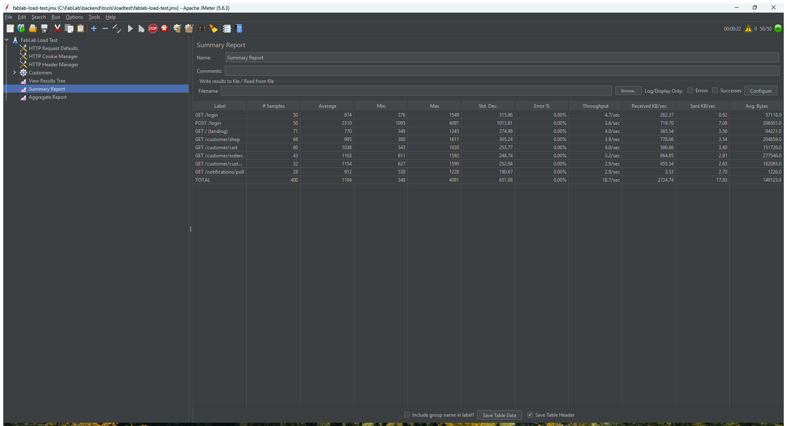
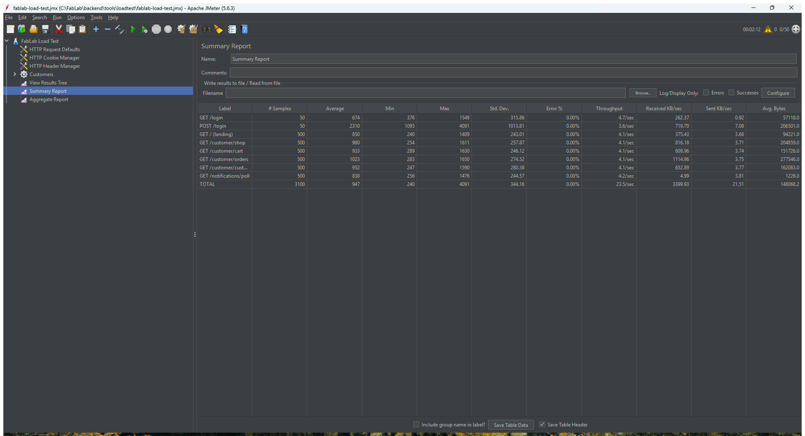
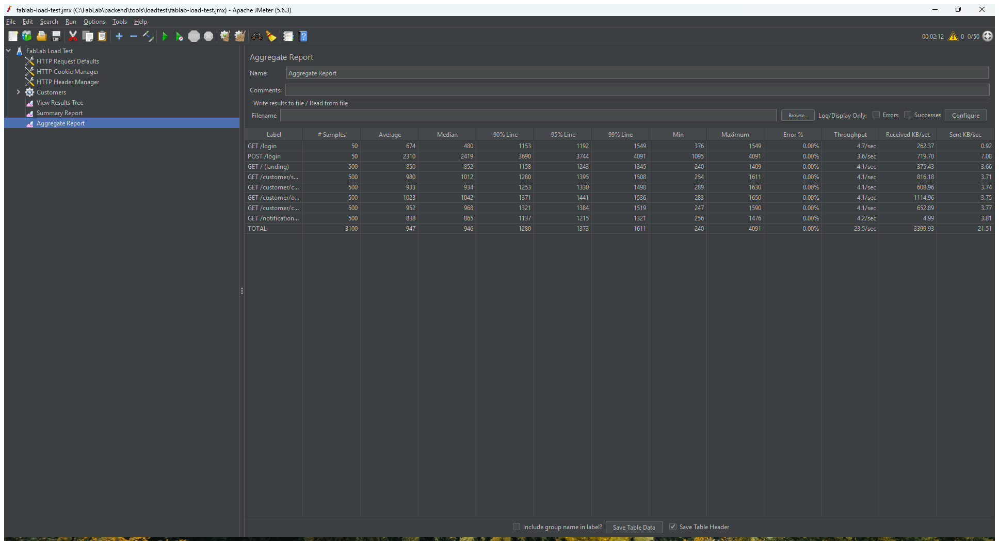
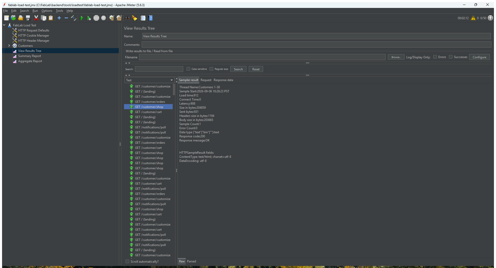
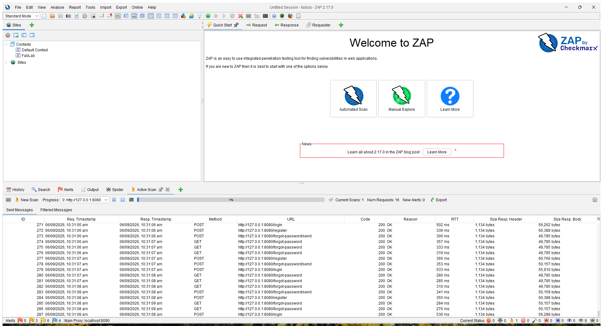
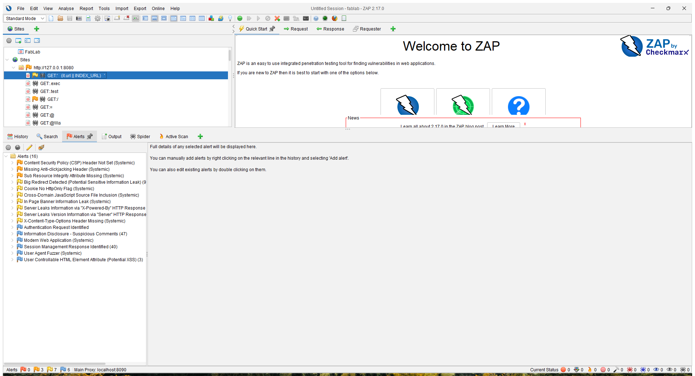
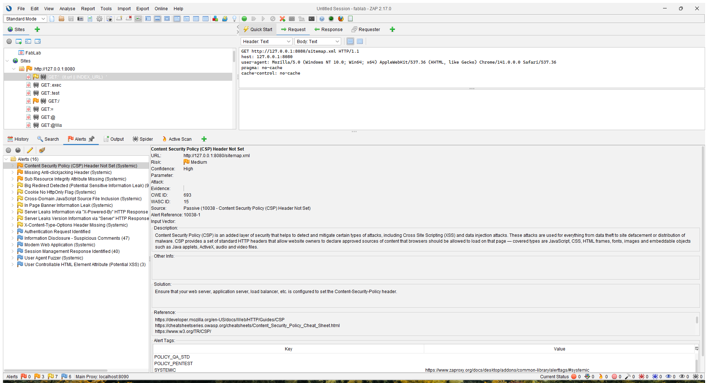
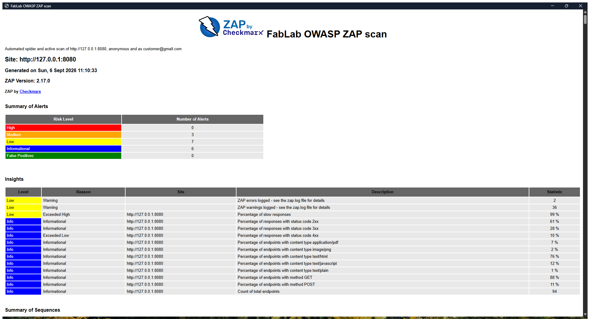

# FabLab – Performance and Security Testing

Date: 6 September 2026
Tester: automated run driven by Claude Code on the developer's Windows 11 machine
System under test: FabLab (Laravel 12, PHP 8.2.12, MySQL 8 via XAMPP), branch `main` at commit `8560c5a`

This document records two rounds of testing:

1. **Load testing with Apache JMeter 5.6.3** – 50 concurrent customers browsing the shop.
2. **Security testing with OWASP ZAP 2.17.0** – automated spider and active scan, first anonymously and then logged in as a customer.

**To run either test yourself**, follow the [Testing Guide](TestingGuide.md) — it covers the tool paths, how the app has to be served, the exact commands, and how to put the machine back afterwards.

All raw artefacts live under [backend/docs/testing/](testing/):

| Path | What it is |
| --- | --- |
| `testing/jmeter/results.jtl` | Raw JMeter sample log for the final headless run (config cached) |
| `testing/jmeter/html-report/index.html` | JMeter HTML dashboard generated from that run |
| `testing/jmeter/results-run1-no-config-cache.jtl` | The first run, kept as evidence of the config race described below |
| `testing/jmeter/html-report-run1-no-config-cache/` | Dashboard for that first run |
| `testing/zap/zap-report.html` | Full OWASP ZAP report (HTML) |
| `testing/zap-20260920/` | A repeat scan run on 20 September 2026 — see [§3.4](#34-repeat-scan-20-september-2026) |
| `testing/zap/zap-report.json` / `.md` | Same report as JSON and Markdown |
| `testing/screenshots/` | Screenshots of the JMeter and ZAP desktop apps |
| `../tools/loadtest/fablab-load-test.jmx` | The JMeter test plan (open it in JMeter to re-run) |
| `../tools/loadtest/zap-scan.ps1` | Script that drives ZAP through its API to reproduce the security scan |

## 1. Test environment

`php artisan serve` is single-threaded on Windows, so it cannot take 50 concurrent users; every request would simply queue behind the previous one and the timings would measure the queue, not the application. For both tests the application was therefore served by XAMPP's Apache 2.4 with the PHP 8.2 module, through a standalone instance listening on port 8080 whose document root is `backend/public`. MySQL was the normal local XAMPP service. The mailer was switched to the `log` driver for the duration of the tests so that ZAP's attacks on the register and forgot-password forms did not send real email.

The seeded accounts were used throughout. The customer account (`customer@gmail.com`, password `password`) was the one exercised by both JMeter and the authenticated ZAP scan.

## 2. Load testing with Apache JMeter

### 2.1 Test plan

The plan simulates a customer session:

| Step | Request | Notes |
| --- | --- | --- |
| Once per user | `GET /login` | The `_token` CSRF value is extracted with a regular expression |
| Once per user | `POST /login` | Posts the token, email and password; asserts the redirect lands on `/customer/shop` |
| Every loop | `GET /` | Public landing page |
| Every loop | `GET /customer/shop` | Product catalogue |
| Every loop | `GET /customer/cart` | Cart page |
| Every loop | `GET /customer/orders` | Order history |
| Every loop | `GET /customer/customize` | 3D customiser page |
| Every loop | `GET /notifications/poll` | The JSON endpoint the bell icon polls |

A uniform random think time of 0.5 to 1.5 seconds sits between requests. Cookies are kept per thread so each virtual user holds its own Laravel session.

Load profile: **50 users, 10-second ramp-up, 10 loops each**, giving 3,100 samples per run. Listeners: View Results Tree, Summary Report and Aggregate Report.

### 2.2 Run 1 – 5% of requests failed with HTTP 500

The first run against a freshly configured Apache returned 155 HTTP 500 responses out of 3,100 (5.0%), spread across every page:

| Request | Samples | Avg (ms) | Max (ms) | Errors | Error % |
| --- | ---: | ---: | ---: | ---: | ---: |
| GET /login | 50 | 583 | 1,366 | 0 | 0.00% |
| POST /login | 50 | 1,726 | 2,828 | 0 | 0.00% |
| GET / | 500 | 1,229 | 3,392 | 23 | 4.60% |
| GET /customer/shop | 500 | 1,396 | 7,823 | 22 | 4.40% |
| GET /customer/cart | 500 | 1,475 | 42,275 | 28 | 5.60% |
| GET /customer/orders | 500 | 1,433 | 3,768 | 16 | 3.20% |
| GET /customer/customize | 500 | 1,407 | 9,629 | 34 | 6.80% |
| GET /notifications/poll | 500 | 1,223 | 3,649 | 32 | 6.40% |
| **Total** | **3,100** | **1,354** | **42,275** | **155** | **5.00%** |

The Laravel log showed the cause. Under concurrent load some requests were reading the framework's *default* configuration instead of `.env`:

```
SQLSTATE[HY000] [1049] Unknown database 'laravel' (Connection: mysql, ... Database: laravel ...)
Database file at path [fablab_db] does not exist. (Connection: sqlite, Database: fablab_db ...)
```

Apache on Windows runs PHP as a threaded module, and Laravel's `.env` loader uses `putenv()`/`getenv()`, which are shared across the threads of one process. When many requests bootstrap at the same instant they race on that shared environment and some of them see `DB_CONNECTION=sqlite` or `DB_DATABASE=laravel`, the values Laravel falls back to. This is a known limitation of reading `.env` per request and is exactly why Laravel's deployment guide requires `php artisan config:cache` in production: with the configuration cached, `env()` is never called at request time.

### 2.3 Run 2 – configuration cached, 0 errors

After running `php artisan config:cache` the same plan was executed again:

| Request | Samples | Avg (ms) | Max (ms) | Errors | Error % |
| --- | ---: | ---: | ---: | ---: | ---: |
| GET /login | 50 | 404 | 926 | 0 | 0.00% |
| POST /login | 50 | 1,339 | 2,222 | 0 | 0.00% |
| GET / | 500 | 659 | 1,942 | 0 | 0.00% |
| GET /customer/shop | 500 | 778 | 1,711 | 0 | 0.00% |
| GET /customer/cart | 500 | 771 | 2,157 | 0 | 0.00% |
| GET /customer/orders | 500 | 800 | 2,194 | 0 | 0.00% |
| GET /customer/customize | 500 | 818 | 2,057 | 0 | 0.00% |
| GET /notifications/poll | 500 | 694 | 2,048 | 0 | 0.00% |
| **Total** | **3,100** | **757** | **2,222** | **0** | **0.00%** |

Throughput was 25.6 requests per second sustained over the 121-second run, with 50 users active. No request exceeded 2.3 seconds and the median page load with 50 concurrent users was under one second.

### 2.4 Run 3 – JMeter GUI run (screenshots)

The plan was then run a third time from the JMeter desktop application so the listeners could be captured. Results were consistent with run 2: 3,100 samples, 0.00% errors, average 947 ms, 23.5 requests per second.



*Figure 1 – JMeter Summary Report while the test is running, all 50 threads active.*



*Figure 2 – JMeter Summary Report after the run: 3,100 samples, 0.00% errors, 23.5 requests/second.*



*Figure 3 – JMeter Aggregate Report showing median, 90th, 95th and 99th percentile response times per page.*



*Figure 4 – JMeter View Results Tree; every sample is green and the selected `/customer/shop` request returned HTTP 200 with a 204 KB body in 912 ms.*

### 2.5 Observations

- **Login is the slowest step** (average 1.3 to 2.3 s under load). That is the cost of bcrypt password hashing plus session regeneration, and is expected.
- **The pages are heavy.** The shop is 204 KB, the orders page 277 KB and the cart 151 KB of HTML per request. Most of that is inline Blade markup and scripts; moving repeated markup into cached views or paginating the orders list would cut bandwidth and time-to-first-byte.
- **The notification poll costs as much as a full page.** `/notifications/poll` returns 29 bytes but takes about as long as rendering the shop because it boots the whole framework. It is fine at this scale, but if the poll interval is ever shortened it will dominate the request mix.
- **`config:cache` is mandatory** for any multi-threaded deployment of this app on Windows/Apache. Without it roughly one request in twenty fails under load.

## 3. Security testing with OWASP ZAP

### 3.1 Method

ZAP 2.17.0 was run as a desktop application with its API enabled and driven by [zap-scan.ps1](../tools/loadtest/zap-scan.ps1), so the run is repeatable. The script:

1. Creates a **FabLab context** covering `http://127.0.0.1:8080/*` and excludes `/logout` and `/login/google` so the scanner cannot log itself out or wander off to Google.
2. Registers **form-based authentication** against `POST /login` with the seeded customer account. ZAP is told that `_token` is an anti-CSRF token, so it fetches the login page and fills in a fresh Laravel token before each login. "Logged in" is detected by the presence of the `/logout` form, "logged out" by the password field.
3. **Phase 1 (anonymous):** traditional spider from `/`, then an active scan of everything found. This covers the landing page, login, register, forgot-password and verify-code flows.
4. **Phase 2 (as customer):** spider and active scan as the authenticated user, covering the shop, cart, checkout, orders, customiser, saved designs, notifications and settings.
5. Writes the report as HTML, JSON and Markdown.

Active scans were capped at 25 minutes per phase. The anonymous scan sent 5,206 attack requests and raised 93 alerts; the customer scan of `/customer/shop` sent 111; and a final customer-wide scan of the whole `/customer` section sent a further 5,928 requests, reaching 60% of its rule set before the cap and raising no new alerts. The spider also picked up about a hundred nonsense URLs such as `/%5C%5C*%7C/` because it extracts anything that looks like a path from inline JavaScript, including regular-expression fragments; those all returned 404 and are only noise.

### 3.2 Results

ZAP sent 11,481 requests in total. **No High-risk alerts were raised.** Sixteen distinct alert types were found (3 Medium, 7 Low, 6 Informational). Counted as instances, one per URL on which each alert appears, the totals were:

| Risk | Alerts |
| --- | ---: |
| High | 0 |
| Medium | 176 |
| Low | 302 |
| Informational | 208 |

Grouped by alert type (a single alert type is reported once per URL, so the instance counts are high for headers that are missing on every page):

| Risk | Alert | What it means for FabLab |
| --- | --- | --- |
| Medium | Content Security Policy (CSP) header not set | No `Content-Security-Policy` header is sent on any page, so the browser has no allow-list of script sources. |
| Medium | Sub Resource Integrity attribute missing | The `<script>` tags that load Bootstrap, Three.js, jQuery and other libraries from `cdn.jsdelivr.net`, `cdnjs.cloudflare.com` and `code.jquery.com` have no `integrity=` hash, so a compromised CDN could serve altered code. |
| Medium | Missing anti-clickjacking header | No `X-Frame-Options` or CSP `frame-ancestors`, so the login and shop pages could be embedded in a hostile iframe. |
| Low | Server leaks version via `Server` header | Apache returns `Apache/2.4.58 (Win64) OpenSSL/3.1.3 PHP/8.2.12`. This is a web-server setting (`ServerTokens Prod`), not application code. |
| Low | Server leaks information via `X-Powered-By` | PHP adds `X-Powered-By: PHP/8.2.12`. Fixed with `expose_php = Off` in `php.ini`. |
| Low | In-page banner information leak | Apache's default 404 page prints its version. Same fix as above, or a custom 404 view for unknown paths. |
| Low | Cross-domain JavaScript source file inclusion | Same root cause as the SRI finding: scripts are loaded from third-party CDNs. |
| Low | `X-Content-Type-Options` header missing | Browsers may MIME-sniff responses. One-line header fix. |
| Low | Cookie without HttpOnly flag | Only the `XSRF-TOKEN` cookie is flagged. Laravel deliberately leaves that cookie readable by JavaScript so that axios can send it back as a header; the real `laravel-session` cookie **is** HttpOnly. Accepted as by design. |
| Low | Big redirect detected | The 302 responses from `/login`, `/register` and the password-reset routes carry a full HTML body as well as the `Location` header. Harmless; ZAP flags it in case the body leaks data. |
| Informational | User-controllable HTML element attribute | The `search` and `category` query strings on `/customer/shop` are echoed back into input values. ZAP did **not** find them exploitable (no XSS alert), because Blade escapes them; this is a "worth knowing" note. |
| Informational | Suspicious comments, modern web application, session management identified, authentication request identified, user-agent fuzzer | Housekeeping notes with no security impact. |

Nothing in the SQL injection, cross-site scripting, path traversal, remote file inclusion, command injection or external redirect rule families produced an alert, against either the public forms or the authenticated customer pages.

The active scan also confirmed two protections that are working as intended:

- **CSRF.** Every forged POST that ZAP sent without a valid `_token` was rejected with HTTP 419, so no cart, checkout, order-cancel, design-save or settings request went through.
- **Validation.** The register, forgot-password and verify-code fuzzing created no rows: the users, orders, products, notifications and designs tables held the same rows after the scan as before, so re-seeding was not required.

### 3.3 Screenshots



*Figure 5 – ZAP during the anonymous active scan; the Active Scan tab shows the fuzzed POSTs to `/login`, `/register` and `/forgot-password/send`.*



*Figure 6 – The customer-wide active scan at its 25-minute cap: 5,928 requests, the Active Scan tab showing fuzzed POSTs to `/customer/profile` while logged in as the customer.*



*Figure 7 – ZAP after all phases: the Sites tree and the Alerts tab listing the 16 alert types, none of them High.*



*Figure 8 – The generated HTML report header. Its Summary of Alerts counts alert types (3 Medium, 7 Low, 6 Informational); the table in section 3.2 counts instances across URLs.*


### 3.4 Repeat scan, 20 September 2026

The scan was run again two weeks later, against the code as it stood on 20 September, on the same machine and through the same [zap-scan.ps1](../tools/loadtest/zap-scan.ps1). It reported the same result:

| | 6 September | 20 September |
| :--- | ---: | ---: |
| High | 0 | 0 |
| Medium | 3 | 3 |
| Low | 7 | 7 |
| Informational | 6 | 6 |
| Distinct alert types | 16 | 16 |
| Alert instances | 153 | 152 |

The one-instance difference is spider coverage, not a fixed or a new finding: the second crawl reached 95 endpoints where the first reached 94, and picked up one fewer session-management response. No alert type appeared or disappeared.

The reports for that run are kept separately in `testing/zap-20260920/` so that the figures quoted in this document stay tied to the 6 September evidence and its screenshots.

### 3.5 Recommended fixes

All of the Medium findings are fixed by one small HTTP middleware that adds response headers, plus `integrity` attributes on the CDN script tags:

1. Add a `SecurityHeaders` middleware to the `web` group that sets `X-Frame-Options: SAMEORIGIN`, `X-Content-Type-Options: nosniff`, `Referrer-Policy: strict-origin-when-cross-origin` and a `Content-Security-Policy` whose `script-src` lists `'self'`, `cdn.jsdelivr.net`, `cdnjs.cloudflare.com` and `code.jquery.com`.
2. Add `integrity="sha384-…" crossorigin="anonymous"` to each CDN `<script>` tag (the hashes are published by jsDelivr and cdnjs), or bundle those libraries through Vite so they are served from the app itself.
3. On the production server set `ServerTokens Prod` / `ServerSignature Off` in Apache and `expose_php = Off` in `php.ini`.
4. Run `php artisan config:cache` (and `route:cache`, `view:cache`) as part of deployment – see section 2.2.

## 4. Summary

| Test | Tool | Outcome |
| --- | --- | --- |
| 50 concurrent customers, 3,100 requests | JMeter 5.6.3 | 0 errors, 757 ms average, 25.6 req/s once the configuration was cached; 5% HTTP 500 without it |
| Automated security scan, anonymous | ZAP 2.17.0 | 0 High, hardening headers missing (Medium), no injection or XSS |
| Automated security scan, as customer | ZAP 2.17.0 | 0 High, CSRF and validation held; same header findings |
