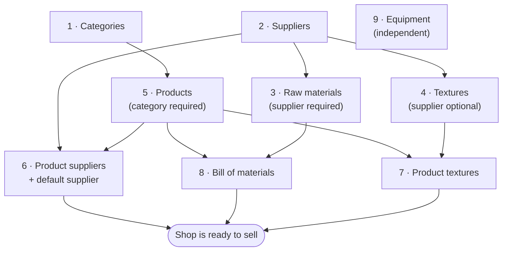
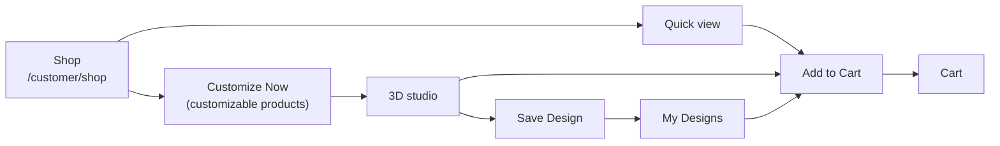
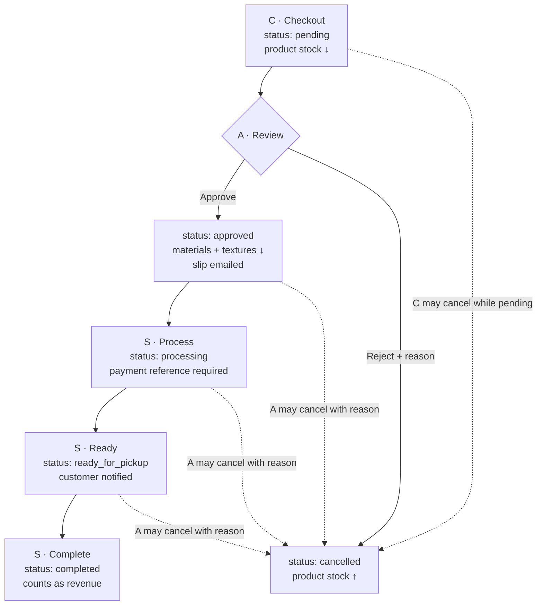
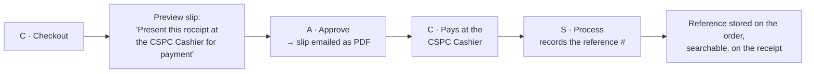

# FABLAB System Process Guide

Every process in the system, **in the order you have to do them**.

The three role guides ([Customer](CustomerUserGuide.md) · [Staff](StaffUserGuide.md) · [Admin](AdminUserGuide.md)) each describe one person's screens. This guide describes the *system* — which process feeds which, what must exist before something else can be created, and where each process hands off to the next role.

**Use it for two things:**

1. **Setting the shop up from an empty database**, in an order where nothing blocks you. Part A.
2. **Recording a tutorial or demo.** Part J is a ready-made script that walks a single product from creation to a completed, paid order in one continuous take.

| | |
| :--- | :--- |
| Related | [User Guides hub](README.md) · [Setup / README](../../README.md) |
| Roles used below | **A** = Admin · **S** = Staff · **C** = Customer |

---

## Contents

| Part | Process | Who |
| :--- | :--- | :--- |
| **A** | [Setup — building the catalog in dependency order](#part-a--setup-processes) | A |
| **B** | [Selling — browse, customize, cart](#part-b--the-selling-process) | C |
| **C** | [Ordering — checkout to hand-over](#part-c--the-order-process) | C → A → S |
| **D** | [Payment](#part-d--the-payment-process) | C → S |
| **E** | [Inventory and stock movement](#part-e--the-inventory-process) | system, A, S |
| **F** | [Procurement — restocking](#part-f--the-procurement-process) | S / A |
| **G** | [Sales and reporting](#part-g--the-reporting-process) | A / S |
| **H** | [Accounts and user management](#part-h--the-account-process) | C / A |
| **I** | [Exception processes — when things go wrong](#part-i--exception-processes) | all |
| **J** | [Demo script for a recorded tutorial](#part-j--demo-script-for-a-recorded-tutorial) | — |
| **K** | [Quick reference](#part-k--quick-reference) | — |

---

# Part A — Setup processes

## A0. Why order matters

The system enforces real dependencies. You cannot create a product without picking a category, and you cannot create a raw material without picking a supplier — the form refuses to save. So a first-time setup has exactly one workable order:



The hard rules, stated plainly:

| To create this | You need this first | If it's missing |
| :--- | :--- | :--- |
| **Product** | A **category** | The form won't save — category is a required field |
| **Raw material** | A **supplier** | The form won't save — supplier is a required field |
| **Texture** | *(nothing)* | Supplier, cost, and stock are all optional — but leave them blank and the texture can never be reordered |
| **Bill of materials** | The **product** and its **raw materials** | Nothing to pick from; the product then consumes no materials on approval |
| **Purchase order** | A **supplier** with items attached to it | The item picker will be empty |
| **Pre-filled purchase order** | A **default supplier** on the item | The item sits in the watchlist's "no supplier" group and can't be auto-ordered |
| **Customization** | A product marked **customizable**, named after a shape the studio can render (t-shirt, mug, umbrella, bag) | The product shows no *Customize Now* button — or opens as a t-shirt if the flag is ticked with no matching model |
| **Textures in the studio** | Textures **assigned to that product** | It offers no textures at all, only plain colours |

> **The one you'll trip over:** skip step 1 and the whole of step 5 is blocked. Create your categories first, always.

---

## A1. Categories — step 1

**Who:** Admin · **Where:** `/admin/categories` · **Detail:** [Admin §5](AdminUserGuide.md#5-categories)

The filing system for products. Every product must belong to exactly one, and customers use them as the filter chips on the shop page.

**Process**

1. Sign in as admin → **Categories**.
2. **Add Category** → enter a **name** (required) and an optional **description**.
3. Save. It's immediately available in the product form and on the shop page.

**Do this first because:** the product form's category dropdown reads from this table, and category is required. An empty category list means you cannot create a single product.

**Rules**

- **A category with products in it cannot be deleted** — including soft-deleted products. The database cascade would take those products and the order lines that reference them. Move the products to another category first.
- Renaming a category is safe at any time; products follow the rename.

**Suggested starting set:** one per department you actually sell from — for example *Books*, *Woodworks*, *Digital Prints*.

**→ Next:** [A2. Suppliers](#a2-suppliers--step-2)

---

## A2. Suppliers — step 2

**Who:** Admin · **Where:** `/admin/suppliers` · **Detail:** [Admin §6](AdminUserGuide.md#6-suppliers)

Everything you buy comes from a supplier. This one record is the hinge of the whole procurement half of the system.

**Process**

1. **Suppliers** → **Add Supplier**.
2. Enter **name** (required), contact person, **email** (must be unique), phone, address.
3. Save.

**Do this second because:** raw materials require a supplier on the create form, and both product supplier assignment (A6) and purchase orders (Part F) select from this list.

**Rules**

- **A supplier still carrying purchase orders or raw materials cannot be deleted.** The refusal message names what's blocking it. Reassign those records first. (Textures survive their supplier's deletion with the field simply cleared.)

**→ Next:** [A3. Raw materials](#a3-raw-materials--step-3)

---

## A3. Raw materials — step 3

**Who:** Admin · **Where:** `/admin/raw-materials` · **Detail:** [Admin §8](AdminUserGuide.md#8-raw-materials)

The consumables a product is made from — wood, ink, glue, paper. Customers never see them. They exist so that approving an order automatically draws down what production will use.

**Process**

1. **Raw Materials** → **Add Raw Material**.
2. Required: **name**, **supplier**, **cost per unit**, **stock quantity**, **low-stock threshold**, **unit**.
3. Optional: description, image, the four unit buckets (on display / sponsored / damaged / consumed), and **department**.
4. Save.

**Field notes for the demo**

- **Low-stock threshold** is what puts the item on the watchlist and fires the alert. Set it to something realistic — a threshold of 0 means you only find out when you're already out.
- **Department** (Digital Customization Center · Book Production · Woodworks) groups the item in the materials report ([Part G](#part-g--the-reporting-process)). Blank items land in *Uncategorized*.

**→ Next:** [A4. Textures](#a4-textures--step-4)

---

## A4. Textures — step 4

**Who:** Admin · **Where:** `/admin/textures` · **Detail:** [Admin §9](AdminUserGuide.md#9-textures)

A texture is two things at once: a **finish a customer picks in the 3D studio**, and a **stock item you buy and consume**. That dual nature is the thing to explain on camera.

**Process**

1. **Textures** → **Add Texture**.
2. **Name** is the only required field. Add an **image** — this is the swatch the customer sees, so it matters.
3. Fill in **supplier**, **cost per unit**, **stock quantity**, **low-stock threshold**, and **unit** so the texture can be reordered like anything else.
4. Set a **price modifier** if this finish costs the customer extra. It's added on top of the customization fees and shown on the swatch.
5. Save.

**Rules**

- A price modifier applies **only to designs added to a cart after you set it**. Orders already placed keep the price they were charged.
- One unit of texture stock is deducted **per ordered unit** when an admin approves an order whose design uses it.

**→ Next:** [A5. Products](#a5-products--step-5)

---

## A5. Products — step 5

**Who:** Admin · **Where:** `/admin/products` · **Detail:** [Admin §7](AdminUserGuide.md#7-products)

The thing the customer actually buys. This is where steps 1–4 pay off.

**Process**

1. **Products** → **Add Product**.
2. Required: **name**, **SKU** (unique), **category** ← *from step 1*, **price**, **stock**, **unit**.
3. Optional but worth setting: brand, description, **low-stock threshold**, the unit buckets, **department**, **status**, an **image** (max 2 MB), and the **customizable** flag.
4. Save — **the system takes you straight to the supplier assignment screen**, because a product with no supplier can never be pre-filled into a purchase order. That's step A6.

**Two settings decide whether customers can see it**

| Setting | Value needed for the product to appear in the shop |
| :--- | :--- |
| **Status** | `active` or `functional` — *maintenance* and *broken* keep it in the catalog but out of the shop |
| **Price** | Greater than zero |

If a product doesn't show up on the shop page, it's almost always one of these two.

**Deleting** from the product page is a **soft delete** — the row stays so order history and reports still resolve.

**→ Next:** [A6. Product suppliers](#a6-product-suppliers-and-the-default-supplier--step-6)

---

## A6. Product suppliers and the default supplier — step 6

**Who:** Admin · **Where:** `/admin/products/{id}/suppliers` (opens automatically after saving a product)

**Process**

1. Tick each supplier that can provide this product.
2. For each one, enter the **cost**, **minimum order quantity**, and **lead time in days**.
3. Mark exactly one as the **default**.

**Why the default supplier matters:** the [inventory watchlist](#f2-review-the-watchlist) groups short items by it, and a pre-filled purchase order prices lines against it. An item with no default supplier lands in the "no supplier" group and has to be ordered by hand.

**→ Next:** [A7. Product textures](#a7-product-textures--step-7)

---

## A7. Product textures — step 7

**Who:** Admin · **Where:** `/admin/products/{id}/textures`

Tick the textures a customer may apply to **this** product in the design studio.

> **Watch this one.** If you tick **none**, the studio offers **every texture in the system** for that product — so a customer could apply a wood finish to a book cover. Always tick a deliberate set.

**→ Next:** [A8. Bill of materials](#a8-bill-of-materials--step-8)

---

## A8. Bill of materials — step 8

**Who:** Admin · **Where:** Edit the product → BOM section · **Detail:** [Admin §7](AdminUserGuide.md#7-products)

The recipe: which raw materials, and how much of each, **one unit** of this product consumes.

**Process**

1. **Products** → edit the product.
2. Add each raw material with its **quantity required per unit**.
3. Save.

**What it drives:** when an admin approves an order, the system deducts `BOM quantity × quantity ordered` for every line. A product with no BOM consumes no materials — approval will simply pass it through.

This is also the check that can **block an approval**: if the deduction would take any material below zero, approval is refused and the message names the shortfall ([I3](#i3-approval-refused--not-enough-materials)).

**→ Next:** [A9. Equipment](#a9-equipment--step-9)

---

## A9. Equipment — step 9

**Who:** Admin · **Where:** `/admin/equipment` · **Detail:** [Admin §10](AdminUserGuide.md#10-equipment)

The fixed-asset register for shop machinery — 3D printers, laser cutters, binding machines. **Nothing here is for sale and nothing carries stock.** It has no dependency on the other eight steps, so do it whenever.

**Process:** **Equipment** → **Add Equipment** → name, brand, property number, date acquired, **cost** (required), **status** (Serviceable · Non-Serviceable · Functional · Returned to supplier for repair), notes.

**Why it exists:** it's the sole source for the equipment report ([Part G](#part-g--the-reporting-process)), so property numbers and statuses have to stay accurate.

---

## A10. Setup checklist

Before you open the shop — or before you start recording — confirm all of this:

- [ ] At least one **category** exists
- [ ] At least one **supplier** exists, with a real email
- [ ] Raw materials have **stock** and a **low-stock threshold**
- [ ] Textures have an **image**, **stock**, and a **price modifier** where applicable
- [ ] Products are **active/functional** with a **price above zero** — otherwise they're invisible to customers
- [ ] Every product has a **default supplier** with an agreed cost
- [ ] Only products the studio has a model for (**t-shirt, mug, umbrella, bag**) are marked **customizable**
- [ ] Customizable products have **textures ticked** — assign none and they offer plain colours only
- [ ] Products that consume materials have a **BOM**
- [ ] A **customer test account** is registered and verified

---

# Part B — The selling process

**Who:** Customer · **Detail:** [Customer §4–7](CustomerUserGuide.md#4-browsing-the-shop)



## B1. Browsing

12 products per page. **Search** matches name, SKU, or description; **category chips** narrow to one category; each card shows image, name, price, stock state, and a **Customizable** badge where relevant. Clicking a card opens a quick view with the description and the add-to-cart controls.

## B2. Customizing — the 3D studio

Products marked customizable carry a **Customize Now** button, which opens `/customer/customize`.

| Action | Fee added |
| :--- | :--- |
| Each **text** element | ₱50 |
| Each **shape** | ₱30 |
| Each **logo** | ₱150 |
| **LED lighting** | ₱500 |
| A **texture** with a price modifier | The modifier |

The running total updates live, and the figure the studio shows is the figure the customer pays — it carries through cart, order, and receipt unchanged.

- **Save Design** stores it in My Designs without ordering.
- **Add to Cart** saves it *and* carts it.

The first time a customer saves a **brand-new** design, staff and admins are notified so they can see what's been asked for before it reaches production.

## B3. My Designs

`/customer/my-designs` — preview in 3D, reopen to edit (saving updates the same design rather than creating a copy), add to cart, or delete. Deleting a design does not affect orders already placed with it.

## B4. The cart

- Quantity changes re-check stock immediately; asking for more than exists is refused with *"Insufficient stock! Only N left"*.
- **The same product with two different designs is two separate lines** — they're different things to make.
- The cart is saved to the account, so it survives sign-out and follows the customer between devices.

**→ Hand-off:** [Part C, checkout](#c1-checkout--customer).

---

# Part C — The order process

This is the spine of the system. Three roles touch one order, in a fixed sequence, and **no step can be skipped or reversed**.



## C1. Checkout — Customer

**Where:** `/customer/cart` · **Detail:** [Customer §8](CustomerUserGuide.md#8-checking-out)

1. Tick the lines to buy — part of a cart is fine, the rest stays.
2. Review the **preview slip**, then confirm.
3. The system re-verifies stock for every selected line, creates the order with a number beginning **`ORDR-`**, **deducts product stock**, and clears only those lines from the cart.
4. The customer lands on **My Orders** with the order at **Pending**.

If anything sold out between adding and checking out, the **whole checkout stops** with a message naming the product — nothing is charged or reserved.

**Notifies:** all staff and admins ("New order placed").

## C2. Review — Admin

**Where:** `/admin/orders` · **Detail:** [Admin §4](AdminUserGuide.md#4-reviewing-orders)

**Only `pending` orders carry a Review button.** Everything else opens read-only.

**Before approving, check:** the quantities look sane, any customization is something the shop can actually produce, and finished-goods stock covers it. The materials check is automatic.

**Approve** does five things in one step:

1. Sets the order to `approved`.
2. **Deducts raw materials** — BOM × quantity, for every line.
3. **Deducts texture stock** — one unit per ordered unit, for designs using a texture.
4. **Emails the transaction slip** (PDF receipt with the order-number barcode).
5. Notifies the customer.

Product stock was already taken at checkout, so approval doesn't touch it again. **Review runs once** — a reviewed order can't be reviewed again, otherwise a second approval would deduct materials twice.

**Reject** requires a **written reason**, which the customer reads on their order. The order becomes `cancelled` and product stock is returned; materials were never consumed, so there's nothing else to give back.

## C3. Production — Staff

**Where:** `/staff/orders` · **Detail:** [Staff §4](StaffUserGuide.md#4-processing-orders)

Each row offers **exactly one forward step**:

| Current status | Button | Becomes | Requires |
| :--- | :--- | :--- | :--- |
| `pending` | *(none — "Awaiting admin")* | — | — |
| `approved` | **Process** | `processing` | **A payment reference** |
| `processing` | **Ready** | `ready_for_pickup` | — |
| `ready_for_pickup` | **Complete** | `completed` | — |
| `completed` / `cancelled` | *(none)* | — | — |

Two things staff never do: **approve an order** (admin only) and **cancel one** (ask an admin). Materials were already deducted at approval — staff make what was approved, and correct stock figures if real consumption differed.

Every transition notifies the customer.

## C4. What the customer sees

**My Orders** shows each status as it changes, plus a notification per change. **Details** opens every line with its design preview, the payment reference, the total, and the receipt. The customer can cancel **only while Pending**.

---

# Part D — The payment process

Worth its own section, because **payment happens outside the system**.

There is no card form, no payment gateway, and no online charge anywhere in the application. The system records payment; it does not take it.



| Step | Who | What happens |
| :--- | :--- | :--- |
| 1 | Customer | The checkout preview slip states: **present this receipt at the CSPC Cashier for payment** |
| 2 | Admin | Approving emails the **transaction slip** — a PDF carrying the order number as a **Code 128 barcode**, the customer's details, the lines, and the total |
| 3 | Customer | Pays at the **CSPC Cashier**, presenting the slip. The cashier issues a receipt or transaction number |
| 4 | Staff | Moving the order to **Processing** opens a dialog demanding the **payment reference**. Enter that number — the field is mandatory for this transition |
| 5 | System | The reference is stored on the order, shown in the customer's order details, and is **searchable** on both the staff and admin order lists |

**Why the reference is mandatory at exactly that point:** it's the gate between "paid for" and "being made", and it's how the shop reconciles takings at end of day. Search any order list by reference number to find the order it belongs to.

**Getting the receipt.** The slip is emailed automatically on approval, and **View Receipt** on the order card, in the list, or inside the details panel opens the PDF in a new tab at any time. It exists from `approved` onward — pending and cancelled orders have no slip.

---

# Part E — The inventory process

Stock moves on its own as orders and purchase orders progress. Three item types carry stock, each with its own low-stock threshold.

| Item type | Stock field | Who may edit it |
| :--- | :--- | :--- |
| Product | `stock`, plus on-display / sponsored / damaged / consumed | Admin (all fields), Staff (main stock only) |
| Raw material | `stock_quantity` | Admin and Staff |
| Texture | `stock_quantity` | Admin and Staff |

## E1. Every automatic movement

| Event | Effect |
| :--- | :--- |
| Customer checks out | Product stock **↓** |
| Customer cancels a pending order | Product stock **↑** |
| Admin **approves** an order | Raw materials **↓** (BOM × quantity) and the design's texture **↓**. Refused if it would go below zero |
| Admin **rejects** at review | Product stock **↑** (materials were never taken) |
| Admin cancels an approved / processing / ready order | Product stock **↑**, materials **↑**, textures **↑** |
| Purchase order marked **`delivered`** | Every line **↑** |
| Purchase order moved **back out of** `delivered` | The same amounts **↓** |

## E2. Manual corrections

Staff and admins can always edit a stock figure directly — that's the process after a physical audit, or when the shop floor used more or less than the BOM says. Staff do this on `/staff/products`, `/staff/raw-materials`, and `/staff/textures`.

## E3. Alerts

Low-stock and out-of-stock notifications fire for products, raw materials, and textures alike, **only at the moment stock crosses the line** — not repeatedly while it sits below. The [inventory watchlist](#f2-review-the-watchlist) is the standing view of everything currently short.

---

# Part F — The procurement process

Restocking. Staff and admins have **identical** powers here.

```mermaid
flowchart TD
    A["Item falls to or below<br/>its low-stock threshold"] --> B["Low stock notification<br/>→ staff + admins"]
    B --> C["Inventory watchlist<br/>grouped by default supplier"]
    C --> D["Create PO for that supplier<br/>lines pre-filled from the shortfall<br/>status: draft"]
    D --> E["sent — emailed/phoned to supplier"]
    E --> F["confirmed — supplier acknowledged"]
    F --> G["delivered — goods arrived<br/>EVERY LINE ADDED TO STOCK"]
    D -. "cancelled at any stage" .-> X["cancelled"]
    E -. .-> X
    F -. .-> X
    E -. "past expected date" .-> OD["Overdue alert<br/>daily 07:00"]
    F -. .-> OD
```

## F1. The trigger

An item crosses its low-stock threshold and raises a notification to every staff member and admin.

## F2. Review the watchlist

`/staff/inventory` or `/admin/inventory` — **not** a full stock list. It shows only what has fallen to or below threshold, across all three item types, grouped by **default supplier**.

Items with no default supplier sit in their own group and can't be pre-filled. **Only an admin can assign one** (`Assign default supplier` on the admin watchlist) — for a product you must also give the agreed cost.

## F3. Create the purchase order

1. **Create PO**, or start from a supplier group on the watchlist.
2. Pick the **supplier**.
3. Add **lines** — each is one product, raw material, or texture with a quantity and cost per unit. The picker only offers what that supplier actually provides.
4. Optionally set an **expected delivery date** — this is what the overdue alert watches.
5. Save. The PO is created as a **draft**, numbered `PO-20260804-A1B2` (date plus random suffix), with the total calculated for you.

**The shortcut:** starting from a watchlist supplier group pre-fills every short item of theirs — quantity set to the shortfall, raised to the supplier's minimum order quantity where one is set, priced at the agreed cost. Check the numbers, then save.

## F4. Move it along

| Set to | When | Effect |
| :--- | :--- | :--- |
| `sent` | You've emailed or phoned it through | None |
| `confirmed` | The supplier acknowledged it | None |
| `delivered` | The goods are physically in front of you | **Every line is added to stock** |
| `cancelled` | It's not happening | None |

**Mark `delivered` only when the delivery has actually arrived** — that click is what puts the stock in. Marked in error? Moving it back off `delivered` removes the same quantities again.

Every status change notifies all staff and admins.

## F5. Overdue chasing

A daily **07:00** check flags any PO still `sent` or `confirmed` past its expected delivery date and notifies the team **once per PO**. It needs Laravel's scheduler running on the server — locally that comes up with `composer dev`; in production it needs the cron entry in [README §12](../../README.md#12-production-deployment-notes). Without it, overdue POs pass silently.

---

# Part G — The reporting process

## G1. Sales

**Who:** Staff and Admin · **Where:** `/staff/sales`, `/admin/sales`

Reports **completed orders only** — nothing counts until it's been handed over. Pick a range (7 days, 30 days, 90 days, 12 months, all time, or custom from/to) for revenue, order count, average order value, items sold, all-time revenue, a revenue/orders chart (daily, switching to monthly beyond ~10 weeks), top sellers, recent sales, and a status breakdown.

**Admins can export** the on-screen range as **PDF** or **DOCX**, so the document always matches the figures on screen. Staff see the same numbers without the export buttons.

## G2. Inventory reports

**Who:** Admin only · **Where:** `/admin/reports`

| Report | Covers | Filters | Output |
| :--- | :--- | :--- | :--- |
| **Materials** | Products, raw materials, and textures in one document, split into sections by **department** (Digital Customization Center · Book Production · Woodworks · Uncategorized). Columns: type, name, unit, on display, sponsored, damaged, consumed, available | Item group, last-updated date range, name search, single department | PDF preview · PDF · DOCX |
| **Equipment** | Name, brand, property number, date acquired, cost, status | Status, date-acquired range, search across name/brand/property number | PDF preview · PDF · DOCX |

Files download as `inventory-materials[-department]-YYYY-MM-DD` and `inventory-equipment-YYYY-MM-DD`. All three formats render from the same layout, so the PDF you file matches the preview.

**This is why the unit buckets and departments exist** in the product, raw material, and texture forms — set them during A3–A5 or the report columns come out empty.

---

# Part H — The account process

## H1. Registration — Customer

**Self-registration always produces a customer account.** The email address does not decide the role.

1. `/register` → full name, email, contact number, password (8+ characters, twice).
2. Choose delivery for the verification code: **SMS** or **email**.
3. Enter the 6-digit code. The account activates and lands on the shop.

**Google sign-up** creates an already-verified customer instantly — no code, no phone step.

Registering again with an email that was never verified simply updates the details and sends a fresh code.

## H2. Staff and admin accounts

There is no staff or admin sign-up form. These accounts are **created directly in the database** — see `database/seeders/UserSeeder.php`, which creates one of each for a fresh install. **Change those passwords before any real deployment.** Roles are not editable in the UI either; changing someone's role is a database operation.

## H3. Sign-in routing

After sign-in each role lands on its own page: customers on the shop, staff on `/staff/dashboard`, admins on `/admin/dashboard`. Each role is confined to its own area, with one deliberate crossing: **admins may also use the staff screens**, so a shop with no staff on duty can still finish an order.

## H4. Password reset

**Forgot Password** → enter email → the system shows the masked email and phone and asks which to send the code to → enter the 6-digit code (**expires 10 minutes after it's sent**) → set the new password.

## H5. Enabling and disabling — Admin

`/admin/users` lists every account. **Disable** locks an account out of both password and Google sign-in while leaving all its orders and history intact; **Enable** restores it. You cannot disable your own account.

**Prefer disabling to deleting** — it revokes access without touching order history.

---

# Part I — Exception processes

## I1. Customer cancels

Possible **only while the order is Pending**. Product stock returns immediately. After that the customer must ask the shop.

## I2. Shop cancels

| When | Who | Reason required | What returns |
| :--- | :--- | :--- | :--- |
| At review (`pending`) — **Reject** | Admin | Yes | Product stock |
| `approved`, `processing`, or `ready_for_pickup` — **Cancel** | Admin | Yes | Product stock, raw materials, textures |
| `completed` | — | **Not possible** — the order is in the customer's hands | — |

The reason is shown to the customer on their order, and they're notified.

## I3. Approval refused — not enough materials

Approval is **refused** if it would take any material or texture below zero. The message names what's short and by how much — for example *"Fabric (needs 6 m, 5 in stock)"*.

**The fix:** restock via a [purchase order](#part-f--the-procurement-process), mark it `delivered`, then approve the order again. Or correct the stock figure manually if it was simply mis-counted.

## I4. Checkout blocked — sold out

If a selected line's stock no longer covers it, the **entire checkout stops** with a message naming the product. Nothing is reserved or charged. The customer adjusts the quantity or removes the line and tries again.

## I5. Product missing from the shop

Two causes, both admin-side: the status isn't `active`/`functional`, or the price is zero. See [A5](#a5-products--step-5).

## I6. Verification code never arrived

**Resend Code** on the verification page, and check the number or address that was typed — a typo sends the code somewhere else. SMS depends on the shop's gateway being configured; if it never arrives, verify by email instead.

## I7. Sign-in refused — account disabled

Only an admin can re-enable it ([H5](#h5-enabling-and-disabling--admin)).

## I8. Delete refused

| Refusal | Why | Fix |
| :--- | :--- | :--- |
| Category | It still has products, including soft-deleted ones | Move the products to another category |
| Supplier | It still carries purchase orders or raw materials | Reassign those first |
| Raw material / Texture | It appears on a purchase order line | Can't be deleted — it would rewrite purchase history |

---

# Part J — Demo script for a recorded tutorial

A single continuous run that touches every major process in dependency order. Roughly **35–45 minutes** at a comfortable pace. Record with three browser profiles (or three windows) signed in as admin, staff, and customer so you can switch without logging out.

## Before you hit record

- [ ] Database seeded, admin and staff accounts known, scheduler running (`composer dev`)
- [ ] A **customer test account** registered and verified — or record H1 live and use it
- [ ] Product images and texture swatches ready on the desktop for upload
- [ ] Mail working, so the transaction slip actually arrives (show the inbox on camera)
- [ ] Browser zoom at ~110% and notifications from other apps silenced

## Chapter plan

| # | Chapter | Role | Section | ~min |
| :-- | :--- | :--- | :--- | :--- |
| 1 | What the system does, and the three roles | — | [README §1–2](README.md#1-what-the-system-does) | 2 |
| 2 | **Why order matters** — the dependency chain | A | [A0](#a0-why-order-matters) | 2 |
| 3 | Create a category | A | [A1](#a1-categories--step-1) | 2 |
| 4 | Create a supplier | A | [A2](#a2-suppliers--step-2) | 2 |
| 5 | Create a raw material — *point out the supplier requirement* | A | [A3](#a3-raw-materials--step-3) | 3 |
| 6 | Create a texture with a price modifier | A | [A4](#a4-textures--step-4) | 3 |
| 7 | Create a product — *show the category dropdown filling from ch. 3* | A | [A5](#a5-products--step-5) | 4 |
| 8 | Assign suppliers + default, then textures, then the BOM | A | [A6](#a6-product-suppliers-and-the-default-supplier--step-6)–[A8](#a8-bill-of-materials--step-8) | 4 |
| 9 | Register and verify a customer | C | [H1](#h1-registration--customer) | 3 |
| 10 | Browse, quick view, add to cart | C | [B1](#b1-browsing) | 2 |
| 11 | Customize in the 3D studio — *watch the price climb* | C | [B2](#b2-customizing--the-3d-studio) | 4 |
| 12 | Checkout — *show product stock drop in the admin tab* | C | [C1](#c1-checkout--customer) | 3 |
| 13 | Admin reviews and approves — *show materials and texture drop* | A | [C2](#c2-review--admin) | 4 |
| 14 | The emailed transaction slip and the barcode | C | [Part D](#part-d--the-payment-process) | 2 |
| 15 | Staff process with a payment reference | S | [C3](#c3-production--staff) | 3 |
| 16 | Ready for pickup → completed | S | [C3](#c3-production--staff) | 2 |
| 17 | Sales page — *the order now counts as revenue* | A | [G1](#g1-sales) | 2 |
| 18 | Watchlist → pre-filled PO → delivered → stock returns | S | [Part F](#part-f--the-procurement-process) | 5 |
| 19 | Reports: materials and equipment, PDF and DOCX | A | [G2](#g2-inventory-reports) | 3 |
| 20 | Exceptions: rejection with a reason, and a refused approval | A | [I2](#i2-shop-cancels)–[I3](#i3-approval-refused--not-enough-materials) | 3 |
| 21 | User management: disable and re-enable | A | [H5](#h5-enabling-and-disabling--admin) | 2 |

## Moments worth pausing on

These are the points where a viewer understands the system rather than just the buttons:

1. **Chapter 7** — open the category dropdown and show it contains exactly what you made in chapter 3. That's the dependency made visible.
2. **Chapter 12 → 13** — have the admin product list open in a second tab. Stock drops at checkout, then materials drop at approval. Two separate events, and explaining why is the heart of the system.
3. **Chapter 15** — try to move the order to Processing with the reference field empty, so the demand for it is seen, not just described.
4. **Chapter 18** — show the material's stock figure before and after marking the PO `delivered`. That one click is the entire restock.
5. **Chapter 20** — deliberately approve an order that outruns its materials so the shortfall message appears on camera.

## Setting up chapter 20 deliberately

To force the refused approval: edit the raw material and drop its stock below what the BOM needs (say the BOM needs 2 and you set stock to 1), then have the customer order it and try to approve. The message names the material, what's needed, and what's in stock. Restock it via chapter 18's PO and approve successfully to close the loop.

---

# Part K — Quick reference

## K1. Order of setup

`Categories → Suppliers → Raw materials → Textures → Products → Product suppliers → Product textures → BOM → Equipment`

## K2. Order statuses

| Status | Set by | Stock effect |
| :--- | :--- | :--- |
| `pending` | System, at checkout | Product stock already deducted |
| `approved` | **Admin review only** | Raw materials and textures deducted; slip emailed |
| `processing` | Staff — **payment reference required** | None |
| `ready_for_pickup` | Staff | None |
| `completed` | Staff | None — now counts as revenue |
| `cancelled` | Customer (while pending), or Admin | Everything the order took is returned |

## K3. Purchase order statuses

| Status | Stock effect |
| :--- | :--- |
| `draft` | None — every PO starts here |
| `sent` | None |
| `confirmed` | None |
| `delivered` | **Every line added to stock** |
| `cancelled` | None, unless it had been delivered — then the stock comes back off |

## K4. Where each process lives

| Process | Customer | Staff | Admin |
| :--- | :--- | :--- | :--- |
| Categories, Suppliers, Equipment | — | — | `/admin/categories`, `/admin/suppliers`, `/admin/equipment` |
| Products | `/customer/shop` | `/staff/products` (edit only) | `/admin/products` (full) |
| Raw materials, Textures | — | `/staff/raw-materials`, `/staff/textures` | `/admin/raw-materials`, `/admin/textures` |
| Customization | `/customer/customize`, `/customer/my-designs` | — | — |
| Cart and checkout | `/customer/cart` | — | — |
| Orders | `/customer/orders` | `/staff/orders` | `/admin/orders` |
| Inventory watchlist | — | `/staff/inventory` | `/admin/inventory` |
| Purchase orders | — | `/staff/purchase` | `/admin/purchase` |
| Sales | — | `/staff/sales` | `/admin/sales` (+ export) |
| Reports | — | — | `/admin/reports` |
| Users | — | — | `/admin/users` |
| Notifications | `/notifications` | `/notifications` | `/notifications` |

## K5. Identifiers

| Thing | Format | Example |
| :--- | :--- | :--- |
| Order number | `ORDR-` + unique suffix | `ORDR-68A1F3C2D4E5` |
| Purchase order number | `PO-YYYYMMDD-XXXX` | `PO-20260804-A1B2` |
| Payment reference | Whatever the CSPC Cashier issued | recorded by staff at Processing |

## K6. Who can do what

The full matrix is in [README §10](README.md#10-who-can-do-what). The three that decide the shape of every process:

- **Only an admin approves or rejects an order.** Staff see *Awaiting admin* and nothing else.
- **Only staff move an order through production** — one step at a time, no skipping, no going back. (Admins may use the staff screens when nobody's on duty.)
- **Only an admin creates or deletes catalog items**, assigns suppliers, textures, and BOMs, and exports reports. Staff edit what already exists.
