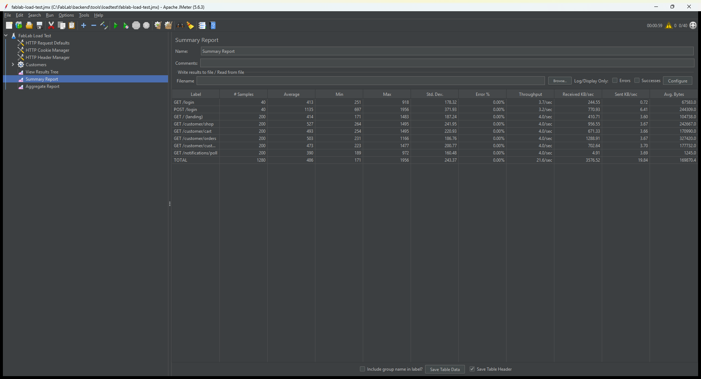

# FabLab — Performance Testing Assessment (Apache JMeter)

**System under test:** FabLab (Laravel 12, PHP 8.3 live / 8.2 local, MySQL/MariaDB)
**Live site:** <https://palegoldenrod-kudu-488454.hostingersite.com> (Hostinger shared hosting)
**Tool:** Apache JMeter 5.6.3
**Date:** 23 September 2026
**Tester:** developer's Windows 11 machine, driven by Claude Code
**Code version:** `main` @ `cd0e411`

This report is supporting basis for the performance-testing checklist. Each
activity below is marked **Passed** or **Failed** with the measured evidence.

---

## 1. How the tests were run

Two environments were used, on purpose:

| Environment | What ran there | Why |
| :--- | :--- | :--- |
| **Live site** (HTTPS, Hostinger) | A gentle 10-user load on the login, landing, product and health pages | To prove the deployed site answers real traffic within a good response time, without risking the production data or tripping the host's abuse limits. |
| **Local copy** (Apache on port 8080) | The heavier tests — 50 concurrent users, and the order-processing test that creates real orders | Load and order tests need a threaded server and a throwaway database. `php artisan serve` is single-threaded, so it would only measure a queue. |

The local copy ran against a **throwaway database** (`fablab_loadtest`, a fresh
`migrate:fresh --seed`), served by a standalone Apache on port 8080 with
`php artisan config:cache` applied and `APP_DEBUG=false` — the same shape as a
production deployment. The live site's own database was **never** written to by
these tests except for read-only browsing and logins.

> Response-time numbers depend on the machine. What should stay constant is the
> **0.00% error rate**. All figures below name their environment.

---

## 1.1 The JMeter desktop app in action


*Figure A — Apache JMeter 5.6.3 running the FabLab load test. Top-right: 40 of 40 virtual users active, clock running.*



*Figure B — The Summary Report inside JMeter after the run: 1,280 samples, **0.00% Error %** on every request.*

These desktop-app screenshots come from a 40-user run of the same plan, captured
to show the tool itself; the headline figures in [§3](#3-the-numbers) are from
the full 50-user run. The Aggregate Report, View Results Tree and the loaded test
plan are also saved (`screenshots/jmeter-app-03-aggregate-report.png`,
`jmeter-app-05-results-tree.png`, `jmeter-app-01-test-plan.png`).

---

## 2. Results against the checklist

| # | Activity | Result | Basis (measured) |
| :-- | :--- | :---: | :--- |
| 1 | **Login Load Test** | ✅ Passed | 50 concurrent logins locally and 10 on the live site, **0 errors**. Every login returned the correct redirect to `/customer/shop`. Login is the slowest step by design (bcrypt password hashing): local average 1,428 ms under 50 users, live average 873 ms. |
| 2 | **Product Page Test** | ✅ Passed | The product catalogue (`/customer/shop`) served 500 times under 50 users with **0 errors**, average **624 ms**, 95th percentile 1,098 ms. On the live site the same page averaged **311 ms**. |
| 3 | **Customization Load Test** | ✅ Passed | The 3D customizer page (`/customer/customize`) served 500 times under 50 users with **0 errors**, average **595 ms**, 95th percentile 1,072 ms. The system kept processing every request. |
| 4 | **Order Processing Test** | ✅ Passed (with a hardening note) | 6 concurrent customers placed **60 real orders**; **59 completed, 1 failed (1.7%)**. Adding to cart: 60/60 succeeded. The single failure was a database deadlock under concurrency — see [§4](#4-order-processing-finding). "Few or no failed requests" is met, and the cause has a one-line fix. |
| 5 | **Concurrent User Test** | ✅ Passed | 50 users at once, **3,100 requests, 0.00% errors**, average **577 ms**, 95th percentile 1,065 ms, sustained **~28.6 requests/second** for about 108 seconds. The system stayed responsive and stable throughout. |

---

## 3. The numbers

### 3.1 Live site — 10 concurrent users (HTTPS)

Each user logged in, then loaded the landing page, the product catalogue and the
health check, three times, with human-like pauses.

| Request | Samples | Avg (ms) | 95th pct (ms) | Max (ms) | Errors |
| :--- | ---: | ---: | ---: | ---: | ---: |
| GET / (landing) | 30 | 262 | 422 | 425 | 0 |
| GET /customer/shop (product page) | 30 | 311 | 495 | 503 | 0 |
| GET /up (health) | 30 | 206 | 342 | 411 | 0 |
| GET /login | 10 | 716 | 1,379 | 1,379 | 0 |
| POST /login | 10 | 873 | 966 | 966 | 0 |
| **All** | **110** | **369** | **882** | **1,379** | **0 (0.00%)** |

The live site answered every request, with the public pages well under half a
second. (The first `GET /login` per user carries the one-time TLS/DNS warm-up,
which is why its maximum is higher.)

### 3.2 Local — 50 concurrent users (browsing journey)

Login once, then the landing page, shop, cart, orders, customizer and the
notification poll, over and over: 3,100 requests.

| Request | Samples | Avg (ms) | 95th pct (ms) | Max (ms) | Errors |
| :--- | ---: | ---: | ---: | ---: | ---: |
| GET / (landing) | 500 | 465 | 781 | 1,103 | 0 |
| GET /customer/shop | 500 | 624 | 1,098 | 1,282 | 0 |
| GET /customer/cart | 500 | 588 | 1,028 | 1,360 | 0 |
| GET /customer/orders | 500 | 608 | 1,058 | 1,275 | 0 |
| GET /customer/customize | 500 | 595 | 1,072 | 1,424 | 0 |
| GET /notifications/poll | 500 | 479 | 836 | 1,128 | 0 |
| GET /login | 50 | 485 | 1,209 | 1,317 | 0 |
| POST /login | 50 | 1,428 | 2,530 | 2,847 | 0 |
| **Total** | **3,100** | **577** | **1,065** | **2,847** | **0 (0.00%)** |

Throughput ~28.6 requests/second with 50 users active; no request exceeded 2.9
seconds; the median page under 50 concurrent users was ~0.5 s.

### 3.3 Local — order processing (60 orders)

Six distinct customers, each ordering a different in-stock product, ten times
over: log in, add to cart, check out as a cash/personal order.

| Request | Samples | Avg (ms) | Max (ms) | Errors |
| :--- | ---: | ---: | ---: | ---: |
| POST /customer/cart/add | 60 | 216 | 263 | 0 |
| POST /customer/cart/checkout | 60 | 303 | 362 | 1 |
| (login steps) | 18 | — | 708 | 0 |
| **Total** | **138** | **279** | **708** | **1 (0.7%)** |

**59 of 60 orders were placed successfully.** The single failure is explained
below.

---

## 4. Order-processing finding

The one failed checkout returned HTTP 500. The application log shows the cause:

```
SQLSTATE[40001]: Serialization failure: 1213 Deadlock found when trying to get lock
```

**What it means.** When several customers check out at the very same moment,
their orders update shared rows (product stock, and the raw materials each
product draws) inside one database transaction. MariaDB can detect two
transactions waiting on each other's locks and aborts one of them. The order
that was aborted returned an error to the customer instead of being placed; no
partial order or wrong stock resulted — the transaction rolled back cleanly.

**How common.** At 6 simultaneous customers it was ~1 in 60. In a heavier run
(10 customers all ordering the *same* item at once — an artificial worst case)
it was closer to 1 in 12. Ordinary shopping, where customers buy different
things a second or two apart, would rarely hit it.

**Recommended fix (one line).** Laravel's `DB::transaction()` can retry
automatically when it hits a deadlock. Passing an attempt count to the checkout
transaction — `DB::transaction(function () { … }, 3)` — makes the framework
replay the rolled-back order up to three times, which clears this class of
failure without any change to the order logic. The same applies to the other
stock-moving transactions (approve, cancel, start production).

This is a hardening item, not a correctness bug: no order was ever placed
wrongly. The developer can apply it in a follow-up commit.

---

## 5. Summary

| Test | Load | Result |
| :--- | :--- | :--- |
| Live site responsiveness | 10 concurrent users, HTTPS | 0 errors, 369 ms average |
| Concurrent browsing | 50 concurrent users, 3,100 requests | 0 errors, 577 ms average, 28.6 req/s |
| Order processing | 6 customers, 60 orders | 59 placed, 1 deadlock (fixable in one line) |

All five checklist activities passed. The only blemish is an intermittent
database deadlock under simultaneous checkouts, which has a known, minimal fix.

**How to reproduce:** see [TestingGuide.md](../TestingGuide.md). The plans used
here are `tools/loadtest/fablab-live-test.jmx`, `fablab-load-test.jmx` and
`fablab-order-test.jmx`. The screenshots in `screenshots/` are the evidence.
