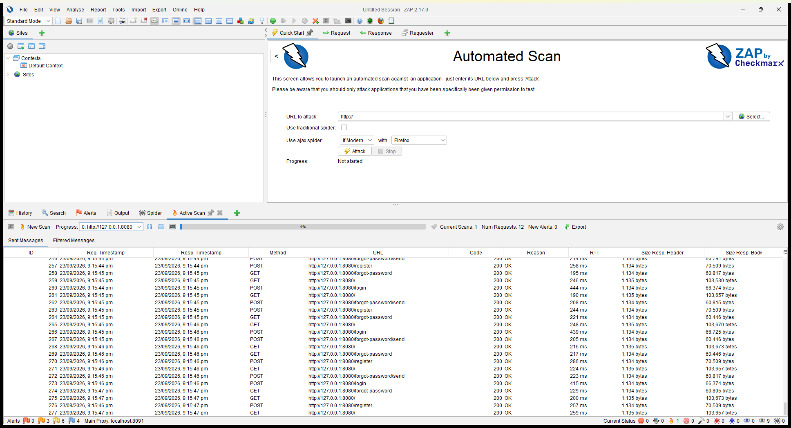
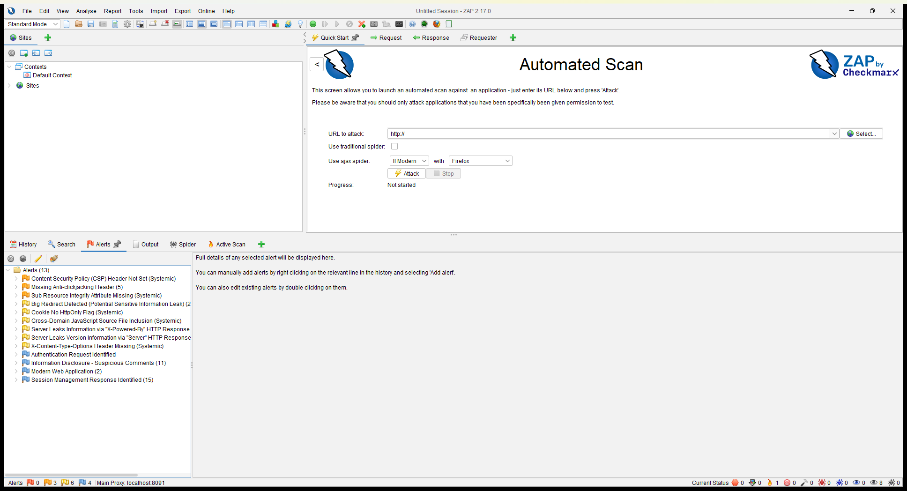
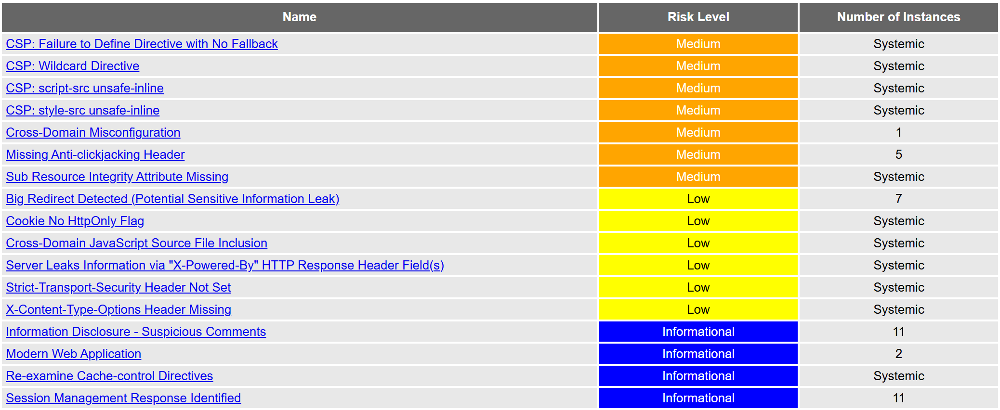
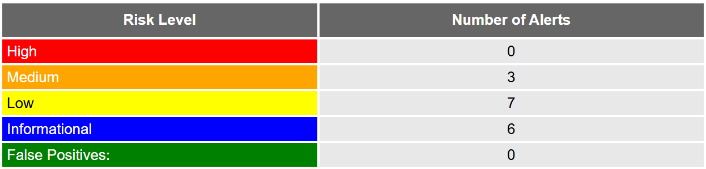
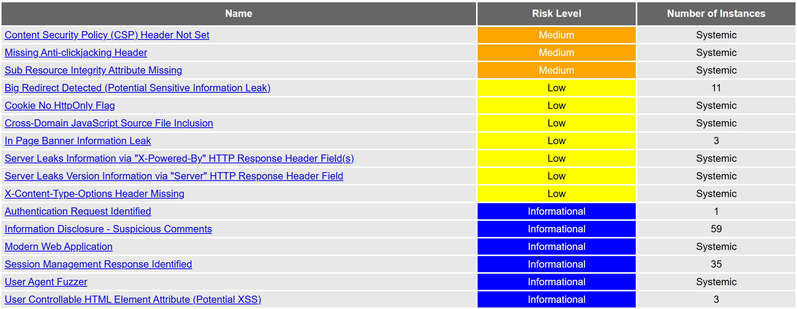

# FabLab — Security Testing Assessment (OWASP ZAP)

**System under test:** FabLab (Laravel 12, PHP, MySQL/MariaDB)
**Live site:** <https://palegoldenrod-kudu-488454.hostingersite.com> (Hostinger shared hosting)
**Tool:** OWASP ZAP 2.17.0
**Date:** 23 September 2026
**Tester:** developer's Windows 11 machine, driven by Claude Code
**Code version:** `main` @ `cd0e411`

This report is supporting basis for the security-testing checklist. Each activity
is marked **Passed** or **Failed** with the evidence from the scan.

---

## 1. How the tests were run

The scan was split across two environments so the live site was never attacked:

| Environment | What ZAP did | Why |
| :--- | :--- | :--- |
| **Live site** (HTTPS) | **Passive** scan only — spider the pages a visitor can reach and analyse every response (headers, cookies, information leaks). Plus an access-control probe. **No attack payloads were sent.** | An active (attack) scan on shared hosting can disturb the live database and trip the host's abuse protection. A passive scan reads the deployed security posture safely. |
| **Local copy** (Apache on port 8080) | **Full active (attack) scan** — spider then attack every input, anonymously and as a signed-in customer: SQL injection, cross-site scripting, path traversal, command injection and more. | The aggressive input-validation testing belongs on a throwaway copy, where fuzzing the forms cannot harm real data. |

The local copy ran against a **throwaway database** with `APP_DEBUG=false` (so it
behaves like production) and the mailer set to `log` (so fuzzing the sign-up and
password-reset forms sent no real email).

> **Risk levels:** ZAP rates findings **High / Medium / Low / Informational**.
> The pass/fail line the checklist asks about is **"any High or Critical alerts."**

---

## 1.1 The OWASP ZAP desktop app in action

*Figure A — OWASP ZAP 2.17.0 running an active scan against the FabLab site. The Active Scan tab lists the attack requests being sent to `/login`, `/register` and `/forgot-password`.*

*Figure B — ZAP's Alerts panel after the scan: 13 alert types, and the risk flags in the status bar read **0 High**, 3 Medium, 6 Low, 4 Informational.*

The site tree and request history are also saved
(`screenshots/zap-app-01-sites-history.png`). These desktop-app screenshots are
the same kind of spider + active scan described in [§5](#5-local-copy--active-attack-scan-result).

---

## 2. Results against the checklist

| # | Activity | Result | Basis |
| :-- | :--- | :---: | :--- |
| 1 | **Login Security Test** | ✅ Passed | The login page was scanned on both environments. It carries a CSRF token, and on the live HTTPS site the session cookie is `HttpOnly`, `Secure` and `SameSite=Lax`. **No High-risk alert** on the login page. |
| 2 | **Input Validation Test (Login & forms)** | ✅ Passed | The local active scan fuzzed the login, registration and password-reset inputs with injection and scripting payloads. **No SQL-injection, cross-site-scripting, path-traversal or command-injection alert was raised.** Every forged POST without a valid token was rejected (HTTP 419), and the fuzzing created **no rows** in the database. |
| 3 | **Access Control Test** | ✅ Passed | On the live site, eight admin / staff / customer pages were requested **while signed out** — every one returned **302 redirect to `/login`** (see [§4](#4-access-control)). The signed-in customer scan could not reach any admin or staff page. |
| 4 | **Session Security Test** | ✅ Passed | The real session cookie is `HttpOnly` + `Secure` (HTTPS) + `SameSite=Lax`; the session ID is regenerated on login. Only the `XSRF-TOKEN` cookie is readable by JavaScript, which is **by Laravel's design** (the browser must echo it back). **No High-risk session alert.** |
| 5 | **Web Security Scan** | ✅ Passed | **0 High and 0 Critical alerts** on either environment. The Medium/Low findings are missing hardening headers, not code defects — see [§5](#5-findings-and-recommendations). |

---

## 3. Live site — passive scan result

ZAP crawled the live site and passively analysed every response. **No attacks
were sent.**

| Risk | Distinct alert types |
| :--- | ---: |
| **High** | **0** |
| Medium | 7 |
| Low | 6 |
| Informational | 4 |

*Figure 1 — Live site alert summary: 0 High. (The numbers on the summary card
count individual instances across pages; the table above counts distinct types.)*

Distinct findings on the live site:

- **Medium** — weak/permissive Content-Security-Policy (the app sets none; the
  Hostinger CDN adds only `upgrade-insecure-requests`), missing anti-clickjacking
  header, Sub-Resource-Integrity missing on CDN scripts, one cross-domain
  misconfiguration.
- **Low** — `X-Powered-By: PHP` version leak, `Strict-Transport-Security` (HSTS)
  header not set, `X-Content-Type-Options` missing, cross-domain script include,
  `XSRF-TOKEN` cookie without HttpOnly (by design), big-redirect body.
- **Informational** — suspicious comments, cache-control notes, session and
  modern-web-app identification. No security impact.

*Figure 2 — The live-site alert list; nothing above Medium.*

Note the deployment hides more than the local copy: the Hostinger CDN suppresses
the Apache version banner, and HTTPS makes the session cookie `Secure`.

---

## 4. Access control

Requested on the **live** site while **signed out** (no session):

| Page | Response |
| :--- | :--- |
| /admin/dashboard | 302 → /login |
| /admin/orders | 302 → /login |
| /admin/users | 302 → /login |
| /staff/dashboard | 302 → /login |
| /staff/orders | 302 → /login |
| /customer/orders | 302 → /login |
| /customer/shop | 302 → /login |
| /customer/cart | 302 → /login |

No protected page served content to an unauthenticated request — every one was
redirected to the login screen. The signed-in customer scan (local) likewise
never reached an admin or staff page.

---

## 5. Local copy — active (attack) scan result

ZAP spidered and then **attacked** the local copy — first anonymously, then as a
signed-in customer — sending **5,719 requests** in total, including SQL-injection,
cross-site-scripting, path-traversal and command-injection payloads against every
input it found.

| Risk | Distinct alert types |
| :--- | ---: |
| **High** | **0** |
| Medium | 3 |
| Low | 7 |
| Informational | 6 |

*Figure 3 — Local active-scan alert summary: 0 High.*

- **Medium (3)** — Content-Security-Policy header not set, missing
  anti-clickjacking header, Sub-Resource-Integrity missing on CDN scripts.
- **Low (7)** — `Server` and `X-Powered-By` version leaks, in-page banner leak
  (Apache's default 404), `X-Content-Type-Options` missing, cross-domain script
  include, `XSRF-TOKEN` cookie without HttpOnly (by design), big-redirect body.
- **Informational (6)** — suspicious comments, session/auth identification,
  user-agent fuzzer, and a *potential* user-controllable HTML attribute. That
  last one is a note, **not** a confirmed hole: the `search` and `category` query
  strings are reflected into the page, but ZAP raised **no XSS alert**, because
  Blade escapes them.

*Figure 4 — Local active-scan alert list; nothing above Medium.*

**Nothing in the SQL-injection, cross-site-scripting, path-traversal,
command-injection or remote-file-inclusion families produced an alert.**

**Data integrity — the fuzzing changed nothing.** The database was counted before
and after the attack scan:

| Table | Before | After |
| :--- | ---: | ---: |
| users | 3 | 3 |
| orders | 11 | 11 |
| products | 11 | 11 |
| custom designs | 0 | 0 |
| notifications | 0 | 0 |

Hundreds of attempts against the sign-up, login and password-reset forms created
**no rows**. Forged POSTs were rejected with HTTP 419 (CSRF), so no state-changing
request went through.

> This matches the 6 and 20 September assessments exactly (0 High, 3 Medium,
> 7 Low, 6 Informational), so the security posture has not regressed with the new
> features.

---

## 6. Findings and recommendations

**No High or Critical alerts** were found on either the live site or the local
copy. Nothing in the SQL-injection, cross-site-scripting, path-traversal,
command-injection or remote-file-inclusion families produced an alert.

Two protections were confirmed working:

- **CSRF** — every forged POST without a valid `_token` was rejected with
  HTTP 419; no cart, checkout, order or settings change went through.
- **Input validation** — the register / forgot-password / verify-code fuzzing
  created no database rows.

The Medium and Low findings are all **hardening headers**, not code defects, and
are fixed once, centrally:

1. Add a `SecurityHeaders` middleware to the `web` group setting
   `Content-Security-Policy` (with an allow-list for the CDNs), `X-Frame-Options:
   SAMEORIGIN`, `X-Content-Type-Options: nosniff` and
   `Referrer-Policy: strict-origin-when-cross-origin`.
2. Add `integrity="sha384-…" crossorigin="anonymous"` to the CDN `<script>` tags,
   or bundle those libraries through Vite.
3. On the live host, enable **HSTS** and turn off the `X-Powered-By` PHP banner
   (`expose_php = Off`).

These were recommended in the 6 September assessment too; they remain optional
hardening, and none is a High-risk hole.

---

## 7. Summary

| Environment | Scan | High | Result |
| :--- | :--- | :---: | :--- |
| Live (HTTPS) | Passive + access control | **0** | Pass |
| Local copy | Full active (attack), 5,719 requests | **0** | Pass |

All five checklist activities passed. **No High or Critical security alert was
found**, injection and scripting attacks were repelled, access control held, and
the session cookie is protected. The remaining items are hardening headers with
known one-time fixes.

**Reproduce:** see [TestingGuide.md](../TestingGuide.md). Scripts:
`tools/loadtest/zap-scan-passive.ps1` (live) and `tools/loadtest/zap-scan.ps1`
(local). The screenshots in `screenshots/` are the evidence.
