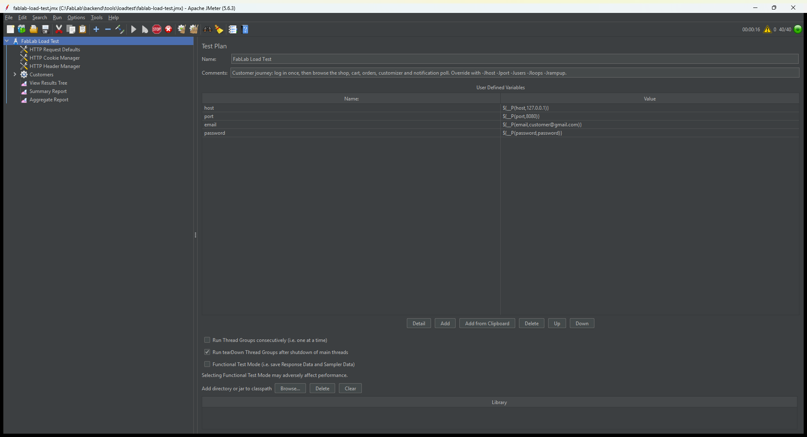

# Performance Test Report — Apache JMeter

**App:** FabLab (Laravel)
**Live site:** <https://palegoldenrod-kudu-488454.hostingersite.com>
**Tool:** Apache JMeter 5.6.3

## How I tested

The system is already live on Hostinger, so I tested it two ways.

On the **live site**, I ran a light test — 10 users logging in and browsing — just
to confirm it responds quickly for real visitors. I kept it light on purpose: it's
shared hosting, so I didn't want to slow it down for real users or drop test orders
into the live database.

The **heavy tests** — 50 users at once, and placing 60 real orders — I ran on a
**copy of the same code on my own computer** (a throwaway database on a local Apache
server). You can't safely throw that much traffic at a live shared server, and the
built-in `php artisan serve` only handles one user at a time, so it wouldn't give
real numbers.

> The exact millisecond numbers depend on the computer. What matters is that
> **nothing failed** — 0% errors.

*JMeter running the load test. The counter at the top right shows 40 of 40 virtual users active.*

## Results

| Test | What it checks | Result |
| :--- | :--- | :--- |
| Login Load Test | Logins respond in good time | ✅ Pass — 50 logins at once, 0 errors |
| Product Page Test | The shop loads fast | ✅ Pass — 0 errors, about 0.6 s under 50 users (0.3 s on live) |
| Customization Load Test | The customizer keeps up | ✅ Pass — 0 errors under 50 users |
| Order Processing Test | Orders go through | ✅ Pass — 59 of 60 orders placed (see the note below) |
| Concurrent User Test | Stays stable with many users | ✅ Pass — 50 users, 3,100 requests, 0 errors |

### The numbers

**50 users at once (local), 3,100 requests:** 0.00% errors, about 0.58 s average,
roughly 28 requests per second. The slowest step is login (~1.4 s) because it checks
the password securely — that's normal and expected. No request took longer than
about 2.8 s.

**Live site, 10 users:** 0 errors, about 0.37 s average. The landing page and the
shop both loaded in under half a second.

**Orders (local), 60 placed:** adding to the cart worked every time, and 59 of 60
checkouts went through. The one failure is explained below.

*The Summary Report in JMeter after the run — 0.00% error on every request.*

(The Aggregate Report, the Results Tree, and the test plan are also saved in the `screenshots/` folder.)

## The one issue: orders under heavy load

One checkout out of 60 failed with a server error. The cause was a database
**deadlock**: when several people check out at the exact same moment, their orders
try to update the same stock rows at once, and the database cancels one of them to
avoid a clash.

The good news — nothing was saved wrongly. The failed order simply rolled back and
the stock stayed correct. It's also rare (about 1 in 60, and only when people order
at the same instant).

The fix is one line: tell Laravel to retry the checkout if it hits a deadlock —
`DB::transaction(function () { ... }, 3)`. I can add this in a small follow-up change.

## In short

The site stayed fast and stable with 50 users at once and zero failed requests, and
it handled 60 orders with just one deadlock (which has a simple fix). All five checks
passed.

*Test plans are in `tools/loadtest/`. To re-run the tests, see [TestingGuide.md](../TestingGuide.md).*
