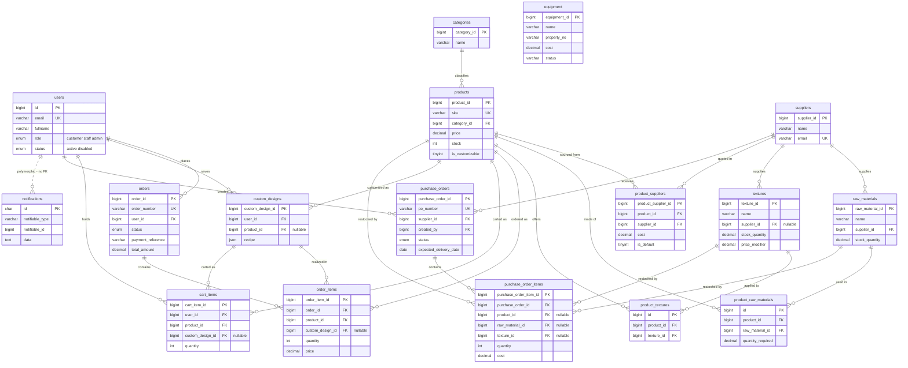

# Entity Relationship Diagram

The FABLAB Inventory Monitoring System database, drawn as an ERD and written out in a form you can type straight into **MySQL Workbench**.

Everything below is taken from the migrations in `backend/database/migrations/`, so the column names, data types, and foreign keys match what `php artisan migrate` actually builds. The narrative version of the same schema — what each table is *for* — is in [DatabaseSchema.md](DatabaseSchema.md).

| | |
| :--- | :--- |
| Tables on the diagram | **17** — 12 domain tables, 3 pivots, 2 standalone |
| Relationship lines to draw | **25**, all **one-to-many** — 23 backed by a real foreign key, 2 drawn as documentation ([#19](#two-lines-that-need-explaining-in-your-write-up) and the [polymorphic line](#61-notifications--draw-the-line-dotted)) |
| Framework tables excluded | `sessions`, `password_reset_tokens`, `cache`, `cache_locks`, `jobs`, `job_batches`, `failed_jobs`, `personal_access_tokens` ([§7](#7-tables-left-off-the-diagram)) |
| Naming convention | Domain tables use a meaningful PK (`product_id`, `order_id`); pivots use `id`; `users` keeps Laravel's `id` |

---

## 1. The diagram



`notifications` hangs off `users` by a **dotted** line — a real relationship with no foreign key behind it. `equipment` sits on the canvas with **no lines at all**, deliberately. Both are explained in [§6](#6-the-two-unconnected-tables).

---

## 2. Which line to draw

**Every relationship in this schema is one-to-many, non-identifying.** There is not a single true one-to-one, so you will use one Workbench tool for all 25 lines:

> **Toolbar → "Place a Relationship Using Existing Columns" (1:n)** — the dashed-line tool.

Three things about that choice:

| Question | Answer | Why |
| :--- | :--- | :--- |
| **Why not the 1:1 tool?** | Nothing here is 1:1 | A one-to-one needs the FK column to be `UNIQUE`. No FK column in this database is unique — one user has many orders, one order has many items, one product appears in many carts |
| **Why non-identifying (dashed), not identifying (solid)?** | Every child table has its own surrogate primary key | An identifying relationship means the child's PK *contains* the parent's FK. Here `order_items` is keyed by `order_item_id` alone, not by `order_id` + something, so the relationship is non-identifying — including for the pivots |
| **Why no many-to-many tool?** | The M:N pairs are already broken out into pivot tables | See [§2.1](#21-the-three-many-to-many-pairs) |

Use **"Using Existing Columns"** rather than the plain 1:n tool. The plain tool *invents* a new FK column on the child table (`products_product_id` and so on), which then doesn't match the migrations. With the existing-columns tool you pick the FK column that's already there.

> **After drawing each line:** double-click it → **Foreign Key** tab → confirm the referenced column, and set **On Delete** to match the table in [§3](#3-the-25-relationship-lines). Workbench defaults to `RESTRICT`; nearly every FK here is `CASCADE`.

### 2.1 The three many-to-many pairs

Each is already normalized into a pivot table, so each becomes **two 1:n lines** — one from each parent into the pivot. This is why no M:N line is needed anywhere.

| Conceptual M:N | Pivot table | Lines to draw | Extra data the pivot carries |
| :--- | :--- | :--- | :--- |
| Products ↔ Suppliers | `product_suppliers` | products → pivot, suppliers → pivot | `cost`, `is_default`, `min_order_qty`, `lead_time_days` |
| Products ↔ Raw materials (**BOM**) | `product_raw_materials` | products → pivot, raw_materials → pivot | `quantity_required` |
| Products ↔ Textures | `product_textures` | products → pivot, textures → pivot | none (pure link, `UNIQUE(product_id, texture_id)`) |

---

## 3. The 25 relationship lines

Draw these one by one. **Parent** is the "1" side (the crow's foot points at the child). Lines 1–24 are backed by a real foreign key; line 25 is the polymorphic one.

| # | Parent (1) | Child (many) | FK column on the child | Null? | On delete |
| :-- | :--- | :--- | :--- | :--- | :--- |
| 1 | `categories` | `products` | `category_id` | NOT NULL | CASCADE |
| 2 | `suppliers` | `raw_materials` | `supplier_id` | NOT NULL | CASCADE |
| 3 | `suppliers` | `textures` | `supplier_id` | NULL | **SET NULL** |
| 4 | `products` | `product_suppliers` | `product_id` | NOT NULL | CASCADE |
| 5 | `suppliers` | `product_suppliers` | `supplier_id` | NOT NULL | CASCADE |
| 6 | `products` | `product_raw_materials` | `product_id` | NOT NULL | CASCADE |
| 7 | `raw_materials` | `product_raw_materials` | `raw_material_id` | NOT NULL | CASCADE |
| 8 | `products` | `product_textures` | `product_id` | NOT NULL | CASCADE |
| 9 | `textures` | `product_textures` | `texture_id` | NOT NULL | CASCADE |
| 10 | `suppliers` | `purchase_orders` | `supplier_id` | NOT NULL | CASCADE |
| 11 | `users` | `purchase_orders` | `created_by` | NOT NULL | CASCADE |
| 12 | `purchase_orders` | `purchase_order_items` | `purchase_order_id` | NOT NULL | CASCADE |
| 13 | `products` | `purchase_order_items` | `product_id` | NULL | CASCADE |
| 14 | `raw_materials` | `purchase_order_items` | `raw_material_id` | NULL | CASCADE |
| 15 | `textures` | `purchase_order_items` | `texture_id` | NULL | CASCADE |
| 16 | `users` | `orders` | `user_id` | NOT NULL | CASCADE |
| 17 | `orders` | `order_items` | `order_id` | NOT NULL | CASCADE |
| 18 | `products` | `order_items` | `product_id` | NOT NULL | CASCADE |
| 19 | `custom_designs` | `order_items` | `custom_design_id` | NULL | *(no DB constraint — see note)* |
| 20 | `users` | `custom_designs` | `user_id` | NOT NULL | CASCADE |
| 21 | `products` | `custom_designs` | `product_id` | NULL | CASCADE |
| 22 | `users` | `cart_items` | `user_id` | NOT NULL | CASCADE |
| 23 | `products` | `cart_items` | `product_id` | NOT NULL | CASCADE |
| 24 | `custom_designs` | `cart_items` | `custom_design_id` | NULL | CASCADE |
| 25 | `users` | `notifications` | `notifiable_id` | NOT NULL | *(polymorphic — no constraint, see [§6.1](#61-notifications--draw-the-line-dotted))* |

**Optional relationships** (#3, 13, 14, 15, 19, 21, 24) have a nullable FK. In Workbench, untick **Mandatory** on the child side of the relationship editor — the line then renders with an open circle (zero-or-more) instead of a bar.

### Two lines that need explaining in your write-up

**#19 — `order_items.custom_design_id` is a link without a constraint.** The column exists and the Eloquent model reads through it, but the migration declares it as a plain `unsignedBigInteger` with **no `FOREIGN KEY`**. Deliberate: it means a customer can delete a design from *My Designs* without the database cascading that delete into the historical order line — the order keeps its record of what was made. Draw it on the diagram (it's a real relationship in the model), and if you want it enforced in the schema, add it as `ON DELETE SET NULL`, never `CASCADE`.

**#13, 14, 15 — a purchase order line points at exactly one of three things.** `purchase_order_items` carries `product_id`, `raw_material_id`, and `texture_id`, all nullable, because one PO can restock finished products, raw materials, and textures in the same document. Each *row* fills in exactly one of the three and leaves the other two `NULL`. That's three separate lines converging on the same child table, and it's the part of the diagram most worth a sentence of explanation.

---

## 4. Table definitions

Types are given as MySQL types, ready to type into Workbench. Laravel's `id()` and `foreignId()` both produce `BIGINT UNSIGNED`; `timestamps()` produces the two nullable `TIMESTAMP` columns; `softDeletes()` produces `deleted_at`.

Flags: **PK** primary key · **AI** auto-increment · **NN** not null · **UQ** unique · **FK** foreign key

### 4.1 `users`

| Column | Type | Flags | Default |
| :--- | :--- | :--- | :--- |
| `id` | BIGINT UNSIGNED | PK, AI, NN | |
| `email` | VARCHAR(255) | NN, UQ | |
| `email_verified_at` | TIMESTAMP | | NULL |
| `password` | VARCHAR(255) | | NULL |
| `fullname` | VARCHAR(255) | | NULL |
| `address` | VARCHAR(255) | | NULL |
| `contact_number` | VARCHAR(255) | | NULL |
| `phone_verified` | TINYINT(1) | NN | 0 |
| `phone_verification_code` | VARCHAR(255) | | NULL |
| `degree` | VARCHAR(255) | | NULL |
| `year` | VARCHAR(255) | | NULL |
| `section` | VARCHAR(255) | | NULL |
| `gender` | VARCHAR(255) | | NULL |
| `photo` | VARCHAR(255) | | NULL |
| `status` | ENUM('active','disabled') | NN | 'active' |
| `notifications_enabled` | TINYINT(1) | NN | 1 |
| `role` | ENUM('customer','staff','admin') | NN | 'customer' |
| `remember_token` | VARCHAR(100) | | NULL |
| `created_at`, `updated_at` | TIMESTAMP | | NULL |

One table holds authentication **and** profile **and** role — there is no separate profile or role table, which is why `users` has no incoming lines at all.

### 4.2 `categories`

| Column | Type | Flags | Default |
| :--- | :--- | :--- | :--- |
| `category_id` | BIGINT UNSIGNED | PK, AI, NN | |
| `name` | VARCHAR(255) | NN | |
| `description` | TEXT | | NULL |
| `created_at`, `updated_at` | TIMESTAMP | | NULL |

### 4.3 `suppliers`

| Column | Type | Flags | Default |
| :--- | :--- | :--- | :--- |
| `supplier_id` | BIGINT UNSIGNED | PK, AI, NN | |
| `name` | VARCHAR(255) | NN | |
| `contact_person` | VARCHAR(255) | | NULL |
| `email` | VARCHAR(255) | UQ | NULL |
| `phone` | VARCHAR(255) | | NULL |
| `address` | VARCHAR(255) | | NULL |
| `created_at`, `updated_at` | TIMESTAMP | | NULL |

### 4.4 `products`

| Column | Type | Flags | Default |
| :--- | :--- | :--- | :--- |
| `product_id` | BIGINT UNSIGNED | PK, AI, NN | |
| `sku` | VARCHAR(255) | NN, UQ | |
| `name` | VARCHAR(255) | NN | |
| `description` | TEXT | | NULL |
| `brand` | VARCHAR(255) | | NULL |
| `price` | DECIMAL(12,2) | NN | 0 |
| `stock` | INT | NN | 0 |
| `units_on_display` | INT | NN | 0 |
| `units_sponsored` | INT | NN | 0 |
| `units_damaged` | INT | NN | 0 |
| `units_consumed` | INT | NN | 0 |
| `category_id` | BIGINT UNSIGNED | **FK**, NN | |
| `department` | VARCHAR(255) | | NULL |
| `status` | VARCHAR(255) | | NULL |
| `is_customizable` | TINYINT(1) | NN | 0 |
| `low_stock_threshold` | INT | | NULL |
| `unit` | VARCHAR(255) | NN | 'pcs' |
| `image` | LONGTEXT | | NULL |
| `deleted_at` | TIMESTAMP | | NULL |
| `created_at`, `updated_at` | TIMESTAMP | | NULL |

`image` is `LONGTEXT` for historical reasons — it once held base64 data URIs and now holds a storage path. `deleted_at` is the soft delete that keeps order history resolvable after a product is removed from the catalog.

### 4.5 `product_suppliers`

| Column | Type | Flags | Default |
| :--- | :--- | :--- | :--- |
| `product_supplier_id` | BIGINT UNSIGNED | PK, AI, NN | |
| `product_id` | BIGINT UNSIGNED | **FK**, NN | |
| `supplier_id` | BIGINT UNSIGNED | **FK**, NN | |
| `cost` | DECIMAL(12,2) | NN | |
| `is_default` | TINYINT(1) | NN | 0 |
| `min_order_qty` | INT | | NULL |
| `lead_time_days` | INT | | NULL |
| `created_at`, `updated_at` | TIMESTAMP | | NULL |

`is_default` is the flag the whole procurement flow keys off — it decides which supplier a shortfall is grouped under and which cost pre-fills a PO line.

### 4.6 `raw_materials`

| Column | Type | Flags | Default |
| :--- | :--- | :--- | :--- |
| `raw_material_id` | BIGINT UNSIGNED | PK, AI, NN | |
| `name` | VARCHAR(255) | NN | |
| `image_path` | LONGTEXT | | NULL |
| `supplier_id` | BIGINT UNSIGNED | **FK**, NN | |
| `cost_per_unit` | DECIMAL(10,2) | NN | |
| `stock_quantity` | DECIMAL(10,2) | NN | 0 |
| `units_on_display` | DECIMAL(10,2) | NN | 0 |
| `units_sponsored` | DECIMAL(10,2) | NN | 0 |
| `units_damaged` | DECIMAL(10,2) | NN | 0 |
| `units_consumed` | DECIMAL(10,2) | NN | 0 |
| `low_stock_threshold` | DECIMAL(10,2) | NN | 10 |
| `unit` | VARCHAR(255) | NN | 'pcs' |
| `description` | TEXT | | NULL |
| `department` | VARCHAR(255) | | NULL |
| `deleted_at` | TIMESTAMP | | NULL |
| `created_at`, `updated_at` | TIMESTAMP | | NULL |

Stock is `DECIMAL`, not `INT`, because materials are measured in metres, litres, and grams.

### 4.7 `textures`

| Column | Type | Flags | Default |
| :--- | :--- | :--- | :--- |
| `texture_id` | BIGINT UNSIGNED | PK, AI, NN | |
| `name` | VARCHAR(255) | NN | |
| `image_path` | VARCHAR(255) | | NULL |
| `description` | TEXT | | NULL |
| `department` | VARCHAR(255) | | NULL |
| `supplier_id` | BIGINT UNSIGNED | **FK** | NULL |
| `cost_per_unit` | DECIMAL(10,2) | NN | 0 |
| `stock_quantity` | DECIMAL(10,2) | NN | 0 |
| `units_on_display` | DECIMAL(10,2) | NN | 0 |
| `units_sponsored` | DECIMAL(10,2) | NN | 0 |
| `units_damaged` | DECIMAL(10,2) | NN | 0 |
| `units_consumed` | DECIMAL(10,2) | NN | 0 |
| `low_stock_threshold` | DECIMAL(10,2) | NN | 10 |
| `unit` | VARCHAR(255) | NN | 'pcs' |
| `price_modifier` | DECIMAL(10,2) | NN | 0 |
| `deleted_at` | TIMESTAMP | | NULL |
| `created_at`, `updated_at` | TIMESTAMP | | NULL |

The only table with a **nullable** supplier and `ON DELETE SET NULL` — a texture survives its supplier being deleted, with the field simply cleared. `price_modifier` is the surcharge the design studio adds when a customer picks this finish.

### 4.8 `product_raw_materials` — the bill of materials

| Column | Type | Flags | Default |
| :--- | :--- | :--- | :--- |
| `id` | BIGINT UNSIGNED | PK, AI, NN | |
| `product_id` | BIGINT UNSIGNED | **FK**, NN | |
| `raw_material_id` | BIGINT UNSIGNED | **FK**, NN | |
| `quantity_required` | DECIMAL(15,2) | NN | |
| `created_at`, `updated_at` | TIMESTAMP | | NULL |

`quantity_required` is per **one unit** of the product. Approving an order multiplies it by the quantity ordered and deducts the result from `raw_materials.stock_quantity`.

### 4.9 `product_textures`

| Column | Type | Flags | Default |
| :--- | :--- | :--- | :--- |
| `id` | BIGINT UNSIGNED | PK, AI, NN | |
| `product_id` | BIGINT UNSIGNED | **FK**, NN | |
| `texture_id` | BIGINT UNSIGNED | **FK**, NN | |
| `created_at`, `updated_at` | TIMESTAMP | | NULL |

Composite **UNIQUE (`product_id`, `texture_id`)** — the same texture can't be attached to the same product twice. Add it in Workbench under the table's **Indexes** tab as a UNIQUE index over both columns.

### 4.10 `purchase_orders`

| Column | Type | Flags | Default |
| :--- | :--- | :--- | :--- |
| `purchase_order_id` | BIGINT UNSIGNED | PK, AI, NN | |
| `po_number` | VARCHAR(255) | NN, UQ | |
| `supplier_id` | BIGINT UNSIGNED | **FK**, NN | |
| `status` | ENUM('draft','sent','confirmed','delivered','cancelled') | NN | 'draft' |
| `expected_delivery_date` | DATE | | NULL |
| `total_cost` | DECIMAL(12,2) | | NULL |
| `created_by` | BIGINT UNSIGNED | **FK** → `users.id`, NN | |
| `created_at`, `updated_at` | TIMESTAMP | | NULL |

`created_by` is the only FK in the schema that doesn't carry the parent's own column name — point it at `users.id` when you draw line #11.

### 4.11 `purchase_order_items`

| Column | Type | Flags | Default |
| :--- | :--- | :--- | :--- |
| `purchase_order_item_id` | BIGINT UNSIGNED | PK, AI, NN | |
| `purchase_order_id` | BIGINT UNSIGNED | **FK**, NN | |
| `product_id` | BIGINT UNSIGNED | **FK** | NULL |
| `raw_material_id` | BIGINT UNSIGNED | **FK** | NULL |
| `texture_id` | BIGINT UNSIGNED | **FK** | NULL |
| `quantity` | INT | NN | |
| `cost` | DECIMAL(12,2) | NN | |

No `created_at` / `updated_at` — a line has no life of its own apart from its purchase order.

### 4.12 `orders`

| Column | Type | Flags | Default |
| :--- | :--- | :--- | :--- |
| `order_id` | BIGINT UNSIGNED | PK, AI, NN | |
| `order_number` | VARCHAR(255) | NN, UQ | |
| `user_id` | BIGINT UNSIGNED | **FK** → `users.id`, NN | |
| `status` | ENUM('pending','approved','processing','ready_for_pickup','completed','cancelled') | NN | 'pending' |
| `payment_reference` | VARCHAR(255) | | NULL |
| `reason` | TEXT | | NULL |
| `total_amount` | DECIMAL(12,2) | NN | |
| `created_at`, `updated_at` | TIMESTAMP | | NULL |

The `status` ENUM is the order lifecycle in a single column. `payment_reference` is the cashier's number, recorded when staff start production; `reason` is the mandatory cancellation reason.

### 4.13 `order_items`

| Column | Type | Flags | Default |
| :--- | :--- | :--- | :--- |
| `order_item_id` | BIGINT UNSIGNED | PK, AI, NN | |
| `order_id` | BIGINT UNSIGNED | **FK**, NN | |
| `product_id` | BIGINT UNSIGNED | **FK**, NN | |
| `custom_design_id` | BIGINT UNSIGNED | *(link only, no FK)* | NULL |
| `quantity` | INT | NN | |
| `price` | DECIMAL(12,2) | NN | |

`price` is a **snapshot** taken at checkout — the base price plus customization fees plus any texture surcharge, frozen so later catalog price changes never rewrite an existing order. No timestamps, same reason as PO items.

### 4.14 `custom_designs`

| Column | Type | Flags | Default |
| :--- | :--- | :--- | :--- |
| `custom_design_id` | BIGINT UNSIGNED | PK, AI, NN | |
| `user_id` | BIGINT UNSIGNED | **FK** → `users.id`, NN | |
| `product_id` | BIGINT UNSIGNED | **FK** | NULL |
| `recipe` | JSON | NN | |
| `snapshot` | LONGTEXT | | NULL |
| `created_at`, `updated_at` | TIMESTAMP | | NULL |

`recipe` is the design itself as JSON — base style, texture, and every text, shape, and logo element placed on it. `snapshot` is the rendered preview image. The price shown in the studio is computed from `recipe`, which is why the studio, cart, and order all agree.

### 4.15 `cart_items`

| Column | Type | Flags | Default |
| :--- | :--- | :--- | :--- |
| `cart_item_id` | BIGINT UNSIGNED | PK, AI, NN | |
| `user_id` | BIGINT UNSIGNED | **FK** → `users.id`, NN | |
| `product_id` | BIGINT UNSIGNED | **FK**, NN | |
| `custom_design_id` | BIGINT UNSIGNED | **FK** | NULL |
| `quantity` | INT UNSIGNED | NN | 1 |
| `price` | DECIMAL(10,2) | NN | 0 |
| `created_at`, `updated_at` | TIMESTAMP | | NULL |

Plus a plain **INDEX (`user_id`, `product_id`)** for cart lookups. Because the cart lives in the database rather than the session, it survives sign-out and follows the customer between devices — and because `custom_design_id` is part of the line, the same product with two different designs is two separate rows.

### 4.16 `equipment`

| Column | Type | Flags | Default |
| :--- | :--- | :--- | :--- |
| `equipment_id` | BIGINT UNSIGNED | PK, AI, NN | |
| `name` | VARCHAR(255) | NN | |
| `brand` | VARCHAR(255) | | NULL |
| `property_no` | VARCHAR(255) | | NULL |
| `date_acquired` | DATE | | NULL |
| `cost` | DECIMAL(12,2) | NN | 0 |
| `status` | VARCHAR(255) | NN | 'Serviceable' |
| `notes` | TEXT | | NULL |
| `deleted_at` | TIMESTAMP | | NULL |
| `created_at`, `updated_at` | TIMESTAMP | | NULL |

### 4.17 `notifications`

| Column | Type | Flags | Default |
| :--- | :--- | :--- | :--- |
| `id` | CHAR(36) | PK, NN | |
| `type` | VARCHAR(255) | NN | |
| `notifiable_type` | VARCHAR(255) | NN | |
| `notifiable_id` | BIGINT UNSIGNED | NN | |
| `data` | TEXT | NN | |
| `read_at` | TIMESTAMP | | NULL |
| `created_at`, `updated_at` | TIMESTAMP | | NULL |

Plus an **INDEX (`notifiable_type`, `notifiable_id`)** from `morphs()`. The PK is a UUID, not an auto-increment.

---

## 5. Building it in Workbench

### 5.1 Order to create the tables

FKs can only point at a table that already exists, so work outward from the tables with no parents:

```
1. users          6. product_suppliers      11. orders
2. categories     7. product_raw_materials  12. custom_designs
3. suppliers      8. product_textures       13. order_items
4. raw_materials  9. purchase_orders        14. cart_items
5. products      10. purchase_order_items   15. equipment
                                            16. notifications
```

(`textures` can go anywhere after `suppliers`; `products` needs `categories` first.)

### 5.2 Steps

1. **File → New Model**, then double-click **Add Diagram** to open the EER canvas.
2. Place each table with the **T** tool and type in its columns from [§4](#4-table-definitions). Set **PK** and **AI** on the first column of every table (except `notifications`, whose UUID PK is not auto-increment).
3. Draw the 25 lines from [§3](#3-the-25-relationship-lines) with **"Place a Relationship Using Existing Columns"** — click the **child's FK column first**, then the **parent's PK**. Getting this backwards is the usual cause of a crow's foot pointing the wrong way.
4. Double-click each line → **Foreign Key** tab → set **On Delete** (`CASCADE` everywhere except line #3, which is `SET NULL`) and untick **Mandatory** for the nullable FKs.
5. Add the composite **UNIQUE** on `product_textures` and the plain indexes on `cart_items` and `notifications` under each table's **Indexes** tab.
6. **Model → Diagram Properties** to set the paper size, then **File → Export → Export as PNG** for the figure in your paper.

### 5.3 Layout that reads well

The diagram makes sense to a reader when the flow runs left to right. A layout that works:

| Band | Tables |
| :--- | :--- |
| **Left column** | `users`, `categories` |
| **Left-centre** | `suppliers`, `custom_designs`, `cart_items` |
| **Centre** (the hub) | `products`, with `product_suppliers`, `product_raw_materials`, `product_textures` clustered tightly around it |
| **Right-centre** | `raw_materials`, `textures` |
| **Right column** | `orders` → `order_items`, and `purchase_orders` → `purchase_order_items` |
| **Bottom corner, unconnected** | `equipment`, `notifications` |

Keep `products` central — 8 of the 25 lines touch it, and putting it anywhere else guarantees crossings. Collapse the **Indexes** section on each table box (the little triangle) so the boxes stay compact, exactly as in your reference figure.

### 5.4 The shortcut, if you'd rather not draw by hand

Workbench can build the whole diagram from the live database:

**Database → Reverse Engineer…** → connect → pick the `fablab` schema → Next through to Execute. Every table, FK, and cardinality comes in already correct; you then drag the boxes into the layout above. This is worth doing even if you draw manually — as a check that what you drew matches the real database.

The one thing reverse engineering won't show is line #19 (`order_items.custom_design_id`), since there's no constraint behind it. Add that line by hand afterwards.

---

## 6. The two unconnected tables

Neither `equipment` nor `notifications` has a foreign key, so both come out of a reverse-engineer floating on their own. That is the schema being honest, not a mistake in the drawing — but the two cases are different, and only one of them should stay disconnected.

### 6.1 `notifications` — draw the line, dotted

It **does** relate to `users`; it just doesn't use a foreign key to do it. Laravel's polymorphic pattern stores the parent as two columns — `notifiable_type` (the class name) and `notifiable_id` (that row's key) — so one table can notify any model in the application.

In this system there is only ever one: **`User` is the only model using the `Notifiable` trait**, so every row has `notifiable_type = 'App\Models\User'` and `notifiable_id` pointing at `users.id`. The cardinality is a straightforward **one user → many notifications**.

The database can't express "this column points at one of several tables" as a constraint, which is the only reason there's no FK. So:

> Draw a **dashed / dotted 1:n line from `users` to `notifications`**, label it **"polymorphic — no FK"**, and note in your caption that the association is enforced by the application rather than by a database constraint.

In Workbench, draw it with the plain **1:n non-identifying** tool between `users.id` and `notifications.notifiable_id`, then **delete the generated foreign key** from the table's Foreign Keys tab so the model still forward-engineers to the real schema — the line stays on the canvas as documentation. (If you'd rather not touch the FK tab at all, use a **text/annotation object** with an arrow instead. Either is acceptable in a documentation ERD.)

### 6.2 `equipment` — leave it standalone

This one is genuinely disconnected, and correctly so. The `Equipment` model declares **no relationships whatsoever**, and no table in the schema references `equipment_id`.

It's a **fixed-asset register**: the machinery the shop owns. Nothing in it is for sale, nothing carries stock, nothing is ordered or supplied through it. It exists so that admins can record property numbers, acquisition dates, costs, and serviceability, and so the equipment report has a source.

A standalone entity is perfectly valid in an ERD — an entity earns its place by being something the system stores facts about, not by having neighbours. What it needs is a sentence so nobody reads it as an omission:

> *`equipment` is an independent register of fixed assets and participates in no relationships; it is maintained and reported on directly by administrators.*

**If you're told every entity must connect to something**, the honest fix is a schema change, not a drawn line: add a nullable `supplier_id` (who the machine was bought from) or `created_by` (who registered it), each a normal 1:n from an existing table. That means a new migration and a new form field, so only do it if the asset register genuinely needs to record that — don't add a column purely to make the diagram look tidier.

### 6.3 Summary

| Table | On the diagram | Line to draw | Why |
| :--- | :--- | :--- | :--- |
| `notifications` | Connected | **Dotted 1:n** from `users` → `notifications` on `notifiable_id`, labelled *polymorphic — no FK* | Real one-to-many; enforced by the application because a polymorphic column can't carry a constraint |
| `equipment` | Standalone | **None** | No relationships exist in the model or the schema; it is a self-contained asset register |

---

## 7. Tables left off the diagram

These are created by Laravel itself and carry no business meaning. Leaving them out is standard practice for a documentation ERD — mention in your caption that framework tables are omitted.

| Table | Purpose |
| :--- | :--- |
| `sessions` | Active login sessions (`user_id` is indexed but has **no** FK) |
| `password_reset_tokens` | Reset tokens, keyed by email |
| `cache`, `cache_locks` | Application cache |
| `jobs`, `job_batches`, `failed_jobs` | Queued job storage |
| `personal_access_tokens` | Sanctum API tokens (polymorphic) |

---

## 8. Reading the diagram in one paragraph

Useful if you need a caption or a paragraph of narrative under the figure.

> A **user** — customer, staff, or admin, distinguished by a role column on the single `users` table — places **orders**, saves **custom designs**, and holds **cart items**. Every **product** belongs to one **category** and is linked to its **suppliers**, its **raw materials** (the bill of materials, carrying the quantity each unit consumes), and the **textures** it may be customized with, through three pivot tables. **Orders** break down into **order items**, each a snapshot of the product, quantity, price, and optionally the custom design it was made from. Restocking runs through **purchase orders**, raised against a supplier by a user, whose **items** may point at a product, a raw material, or a texture — the three stock-bearing entities in the system. **Equipment** stands alone as a fixed-asset register, and **notifications** attaches polymorphically rather than by foreign key.

---

**Figure caption suggestion:** *Entity Relationship Diagram of the FABLAB Inventory Monitoring System, showing 17 entities and 25 one-to-many relationships. The `notifications` association is polymorphic and enforced by the application rather than by a foreign key; `equipment` is an independent fixed-asset register and participates in no relationships. Framework-managed tables (sessions, cache, queue, and token storage) are omitted for clarity.*
