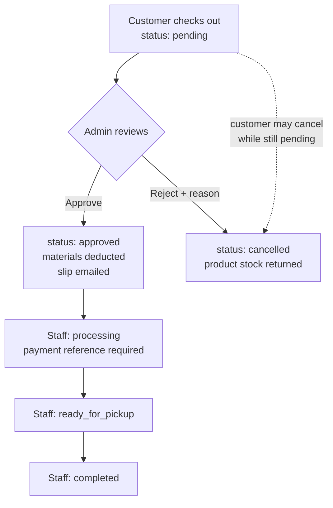

# FABLAB User Guides

This folder holds the three role guides for the FABLAB Inventory Monitoring System. Start here: this page explains how the roles fit together, then sends you to your guide.

| Guide | Who it's for | Signs in at |
| :--- | :--- | :--- |
| [Customer Guide](CustomerUserGuide.md) | Anyone buying or customizing a product | `/customer/shop` |
| [Staff Guide](StaffUserGuide.md) | The people who fulfil orders and run procurement | `/staff/dashboard` |
| [Admin Guide](AdminUserGuide.md) | The people who own the catalog, approve orders, and report | `/admin/dashboard` |

The three guides describe one shared system, so they cross-reference each other constantly. When a section ends with a **Hand-off** note, it tells you which role picks the work up next and links to the exact section they'll be reading.

Related documents: [Setup Guide](../Setup.md) (installing and running the app), [Module Flow](../ModuleFlow.md) and [Database Schema](../DatabaseSchema.md) (developer-facing detail).

---

## 1. What the system does

FABLAB is a small production shop. The system covers four jobs:

1. **Selling** — a catalog of products, some of which a customer can customize in a 3D studio before buying.
2. **Order fulfilment** — every order passes through an admin review, then a staff production queue, until the customer collects it.
3. **Inventory** — stock is tracked for three kinds of item (products, raw materials, textures) plus a fixed-asset register for equipment.
4. **Procurement and reporting** — purchase orders restock what runs low, and admins export inventory and equipment reports as PDF or DOCX.

---

## 2. The three roles

| | Customer | Staff | Admin |
| :--- | :--- | :--- | :--- |
| Browse and buy | Yes | — | — |
| Customize designs | Yes | — | — |
| Approve or reject an order | — | — | **Yes** |
| Move an order through production | — | **Yes** | — |
| Edit catalog items | — | Edit only | Create, edit, delete |
| Create purchase orders | — | Yes | Yes |
| Reports and user management | — | — | **Yes** |

The full breakdown is in [Who can do what](#10-who-can-do-what).

---

## 3. Accounts, sign-in, and verification

**Self-registration always creates a customer account.** The email address does not decide the role — anyone who registers at `/register` becomes a customer. Staff and admin accounts are provisioned directly in the database (see `database/seeders/UserSeeder.php`, which creates one of each, and change those passwords before any real deployment).

Registration collects full name, email, phone number, and a password (minimum 8 characters, typed twice). The account is then verified with a 6-digit code sent by **SMS or email** — the registrant chooses which at sign-up. Signing in with Google creates a customer account that is already verified, with no code step.

After sign-in, the system routes each role to its own landing page: customers to the shop, staff to `/staff/dashboard`, admins to `/admin/dashboard`.

An account whose status is `disabled` cannot sign in at all, by password or by Google. Only an admin can disable or re-enable an account — see [Admin Guide §15](AdminUserGuide.md#15-user-management).

Details per role: [Customer §1](CustomerUserGuide.md#1-creating-your-account) · [Staff §1](StaffUserGuide.md#1-signing-in) · [Admin §1](AdminUserGuide.md#1-signing-in).

---

## 4. Lifecycle of an order

This is the single most important flow in the system, and all three roles touch it.

Step by step, with who does what:

| # | Step | Role | Where | Result |
| :-- | :--- | :--- | :--- | :--- |
| 1 | Place the order | Customer | [Customer §8](CustomerUserGuide.md#8-checking-out) | Order created as `pending`; **product stock is deducted immediately**; staff and admins are notified |
| 2 | Review it | Admin | [Admin §4](AdminUserGuide.md#4-reviewing-orders) | `approved` (raw materials and textures deducted, transaction slip emailed) or `cancelled` with a reason (stock returned) |
| 3 | Prepare it | Staff | [Staff §4](StaffUserGuide.md#4-processing-orders) | `processing` — a payment reference must be recorded here |
| 4 | Set it aside | Staff | [Staff §4](StaffUserGuide.md#4-processing-orders) | `ready_for_pickup`; the customer is notified to collect |
| 5 | Hand it over | Staff | [Staff §4](StaffUserGuide.md#4-processing-orders) | `completed`; the order now counts towards Sales |

The customer sees every one of these transitions on their orders page and, if their notifications are on, as a notification — see [Customer §9](CustomerUserGuide.md#9-tracking-your-orders).

---

## 5. Lifecycle of a restock

Procurement is shared: staff and admins have identical purchase-order powers.

| # | Step | Role | Where |
| :-- | :--- | :--- | :--- |
| 1 | Something drops to or below its low-stock threshold | — | Products also raise a Low stock notification automatically |
| 2 | Check the inventory watchlist, grouped by default supplier | Staff or Admin | [Staff §6](StaffUserGuide.md#6-inventory-watchlist) · [Admin §11](AdminUserGuide.md#11-inventory-watchlist) |
| 3 | Create a PO for that supplier — lines are pre-filled from the shortfall | Staff or Admin | [Staff §10](StaffUserGuide.md#10-purchase-orders) · [Admin §12](AdminUserGuide.md#12-purchase-orders) |
| 4 | Send it to the supplier, then mark it `confirmed` when they agree | Staff or Admin | same |
| 5 | Mark `delivered` when the goods arrive — **this is what puts stock back in** | Staff or Admin | same |

If an item has no default supplier, it can't be pre-filled into a PO. Admins can set one straight from the watchlist — [Admin §11](AdminUserGuide.md#11-inventory-watchlist).

---

## 6. Order status reference

| Status | Set by | What it means | Stock effect |
| :--- | :--- | :--- | :--- |
| `pending` | The system, at checkout | Waiting for admin review | Product stock already deducted |
| `approved` | Admin review only | Accepted for production | Raw materials and textures deducted; slip emailed to the customer |
| `processing` | Staff | Being made; a payment reference is recorded | None |
| `ready_for_pickup` | Staff | Waiting for the customer to collect | None |
| `completed` | Staff | Handed over; counts as a sale | None |
| `cancelled` | Customer (while `pending`), or Admin (rejecting at review, or cancelling any time before hand-over) | Order is dead | Everything it took is returned: product stock, and materials and textures if it had been approved |

Three limits worth knowing:

- Staff cannot set `approved` — that transition exists only in the admin review screen.
- **Staff advance one step at a time.** `approved` → `processing` → `ready_for_pickup` → `completed`, no skipping and no going back.
- **A completed order cannot be cancelled.** Up to hand-over an admin can cancel and the stock comes back; once it's `completed`, it's closed.

---

## 7. Purchase order status reference

| Status | What it means | Stock effect |
| :--- | :--- | :--- |
| `draft` | Created but not yet sent. Every new PO starts here | None |
| `sent` | Transmitted to the supplier (by email or phone, outside the system) | None |
| `confirmed` | The supplier has acknowledged it | None |
| `delivered` | The goods arrived | **Every line is added to stock** |
| `cancelled` | Abandoned; available at any stage | None, unless it had been `delivered` — moving out of `delivered` takes the stock back off |

PO numbers look like `PO-20260804-A1B2`. Any status change notifies all staff and admins.

---

## 8. How stock moves

Three item types carry stock, and each has a low-stock threshold:

| Item type | Stock field | Where it's edited |
| :--- | :--- | :--- |
| Product | `stock`, plus on-display / sponsored / damaged / consumed buckets | Admin (all fields), Staff (main stock only) |
| Raw material | `stock_quantity` | Admin and Staff |
| Texture | `stock_quantity` | Admin and Staff |

Every automatic movement in the system:

| Event | Effect |
| :--- | :--- |
| Customer checks out | Product stock **down** |
| Customer cancels a pending order | Product stock **up** |
| Admin approves an order | Raw materials **down** (by the product's bill of materials × quantity) and the design's texture **down**. Approval is **refused** if that would take anything below zero |
| Admin rejects an order at review | Product stock **up** (materials were never consumed) |
| Admin cancels an approved, processing, or ready order | Product stock **up**, materials and textures **up** |
| PO marked `delivered` | Every line — product, material, or texture — **up** |
| PO moved back out of `delivered` | The same amounts **down** again |

Manual edits to any stock figure are always allowed for staff and admins; use them to correct counts after a physical audit.

Low-stock and out-of-stock notifications fire for **products only**, and only at the moment stock crosses the threshold. Raw materials and textures still appear on the inventory watchlist, but they raise no notification.

---

## 9. Notification reference

The bell in the top bar polls every 30 seconds and shows the ten most recent items; the full page at `/notifications` pages through them 20 at a time. Every role has a personal on/off switch in Settings — turning it off stops all in-app notifications for that account.

| Event | Goes to | Links to |
| :--- | :--- | :--- |
| New order placed | Staff + Admins | Their orders list |
| New custom design saved | Staff + Admins | The design |
| New customer registered | Staff + Admins | The customer |
| Order status changed | The customer who owns it | Their orders page |
| Low stock / Out of stock (products) | Staff + Admins | The inventory watchlist |
| Purchase order status changed | Staff + Admins | That PO |
| Purchase order overdue | Staff + Admins | That PO |

The overdue check runs daily at 07:00 and flags POs still `sent` or `confirmed` past their expected delivery date, once each. It needs Laravel's scheduler running on the server — see [Setup §8](../Setup.md#8-run-the-app).

---

## 10. Who can do what

| Area | Customer | Staff | Admin |
| :--- | :--- | :--- | :--- |
| Shop, cart, checkout | Full | — | — |
| Customization studio, My Designs | Full | — | — |
| Own orders (view, cancel while pending, receipt) | Full | — | — |
| All orders — list and filter | — | Yes | Yes |
| Order review (approve / reject) | — | — | **Yes** |
| Order production statuses | — | **Yes** | — |
| Products | — | Edit | Create, edit, delete, plus suppliers, textures, bill of materials |
| Raw materials, Textures | — | Edit | Create, edit, delete |
| Categories, Suppliers, Equipment | — | — | Create, edit, delete |
| Inventory watchlist | — | View | View, plus assign default supplier |
| Purchase orders | — | Full | Full |
| Sales | — | Yes | Yes |
| Reports (PDF / DOCX) | — | — | **Yes** |
| User accounts | — | — | **Yes** |
| Own profile and notification setting | Yes | Yes | Yes |

Each role is confined to its own area: a customer who lands on an admin or staff page is sent back to the shop, and staff are turned away from everything under `/admin`. The one crossing is deliberate — **admins may also use the staff screens**, because order fulfilment lives only there, so a shop with no staff on duty can still finish an order.

---

## 11. Pricing rules

A product's price is its base price. Customizing it adds fixed fees:

| Add-on | Fee |
| :--- | :--- |
| Each text element | ₱50 |
| Each shape | ₱30 |
| Each logo | ₱150 |
| LED lighting | ₱500 |

Textures can carry their own surcharge (`price_modifier`), which the studio shows on each swatch and which is added on top of the element fees.

The price is worked out from the saved design, so the studio's live quote, the cart, My Designs, and the order line all agree. The order total is the sum of each line's price × quantity, fixed at the moment of checkout — later catalog price changes never rewrite an existing order.

---

## 12. Glossary

| Term | Meaning |
| :--- | :--- |
| **BOM (bill of materials)** | The raw materials, and how much of each, that one unit of a product consumes. Deducted when an admin approves an order |
| **Default supplier** | The supplier used to pre-fill purchase orders for an item. Only one per item |
| **Department** | One of Digital Customization Center, Book Production, or Woodworks. Groups items in the materials report |
| **Design (recipe)** | A saved customization: base style, texture, and the text/shape/logo elements placed on it |
| **Low-stock threshold** | The level at or below which an item appears on the inventory watchlist |
| **Payment reference** | The receipt or transaction number staff record when an order moves to `processing` |
| **Transaction slip** | The PDF receipt, carrying a barcode of the order number, emailed on approval and downloadable by the customer |
